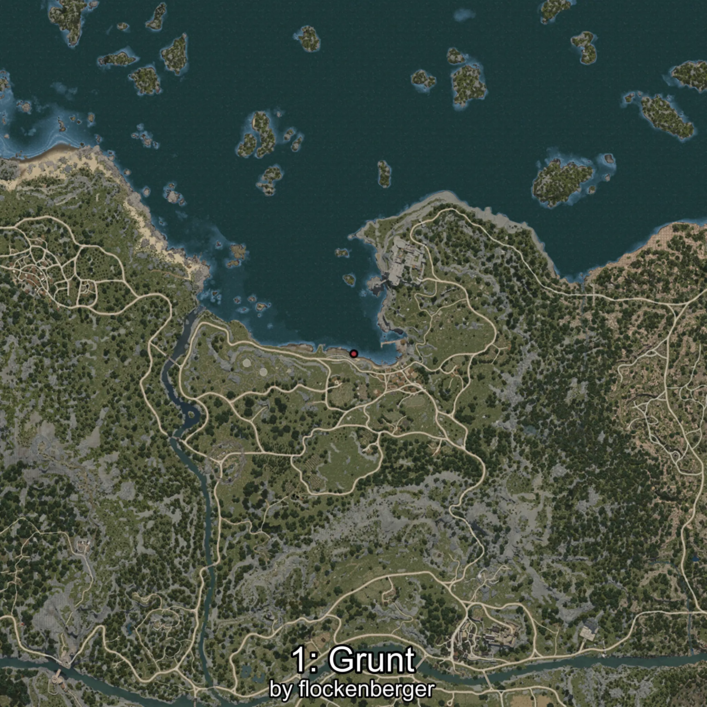

# Grunt
Creado por **flockenberger**

## ⚠️ Advertencia:
Los puntos de pesca se generan según la __**posición de tu personaje**__ — __no__ donde cae el flotador.  
En el océano especialmente, la dirección en la que lances la caña puede colocar tu flotador en una **zona de pesca diferente**, lo que puede resultar en capturar el pez incorrecto.  
Esto solo ocurre en raros casos — cuando la posición está justo en el **borde de una zona** y lanzas hacia el lado “equivocado”.

- Para verificar la posición puedes usar la guía [AQUÍ](https://flockenberger.github.io/bdo-fish-position/)
- O ver la guía [AQUÍ](https://youtu.be/t-VXcRoNojk)

## Waypoints
```xml
<!--
    Puntos de pesca para:: Grunt
    Creado por: flockenberger
-->
<WorldmapBookMark>
    <BookMark BookMarkName="0: Grunt" PosX="161261.0" PosY="-8164.0" PosZ="231211.0" />
    <BookMark BookMarkName="1: Grunt" PosX="-5658.0" PosY="-8256.0" PosZ="88765.0" />
    <BookMark BookMarkName="2: Grunt" PosX="-4724.0" PosY="-8266.0" PosZ="88579.0" />
    <BookMark BookMarkName="3: Grunt" PosX="24.0" PosY="-8131.0" PosZ="86974.0" />
    <BookMark BookMarkName="4: Grunt" PosX="-227257.0" PosY="-8065.0" PosZ="164613.0" />
</WorldmapBookMark>
```

     