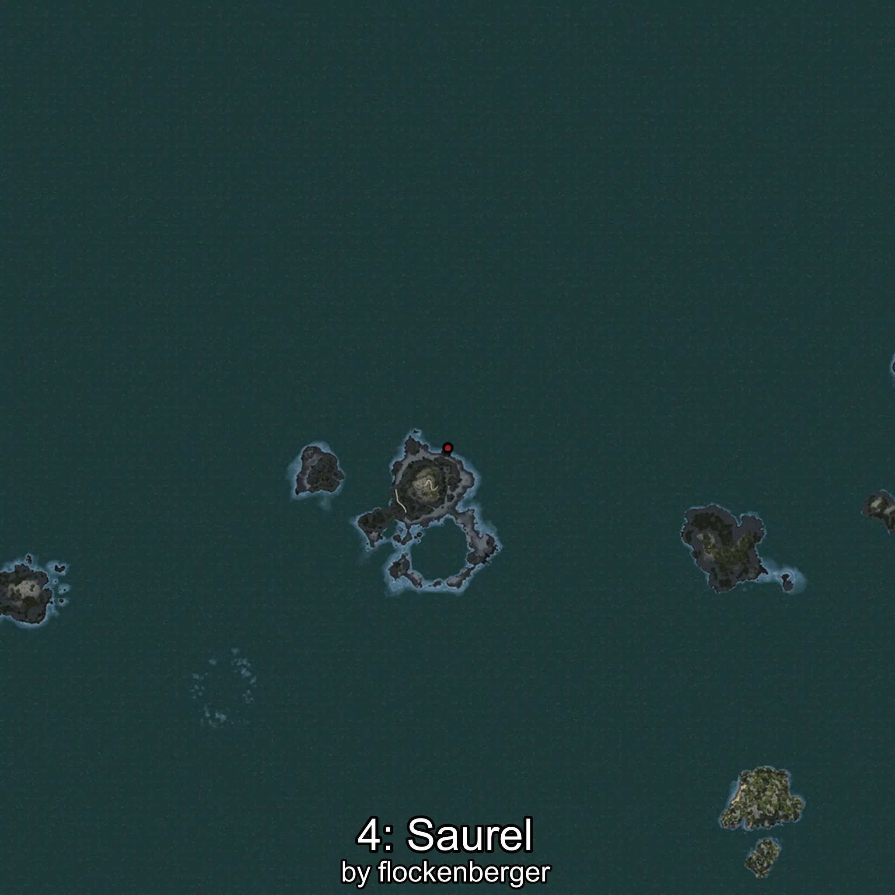

# Jurel
Creado por **flockenberger**

## ⚠️ Advertencia:
Los puntos de pesca se generan según la __**posición de tu personaje**__ — __no__ donde cae el flotador.  
En el océano especialmente, la dirección en la que lances la caña puede colocar tu flotador en una **zona de pesca diferente**, lo que puede resultar en capturar el pez incorrecto.  
Esto solo ocurre en raros casos — cuando la posición está justo en el **borde de una zona** y lanzas hacia el lado “equivocado”.

- Para verificar la posición puedes usar la guía [AQUÍ](https://flockenberger.github.io/bdo-fish-position/)
- O ver la guía [AQUÍ](https://youtu.be/t-VXcRoNojk)

## Waypoints
```xml
<!--
    Puntos de pesca para:: Jurel
    Creado por: flockenberger
-->
<WorldmapBookMark>
    <BookMark BookMarkName="0: Jurel" PosX="-359408.0" PosY="-7658.0" PosZ="217400.0" />
    <BookMark BookMarkName="1: Jurel" PosX="-79578.0" PosY="-8184.0" PosZ="631220.0" />
    <BookMark BookMarkName="2: Jurel" PosX="55162.0" PosY="-7655.0" PosZ="232904.0" />
    <BookMark BookMarkName="3: Jurel" PosX="-415250.0" PosY="-7898.0" PosZ="213077.0" />
    <BookMark BookMarkName="4: Jurel" PosX="-86608.0" PosY="-8109.0" PosZ="638323.0" />
</WorldmapBookMark>
```

     