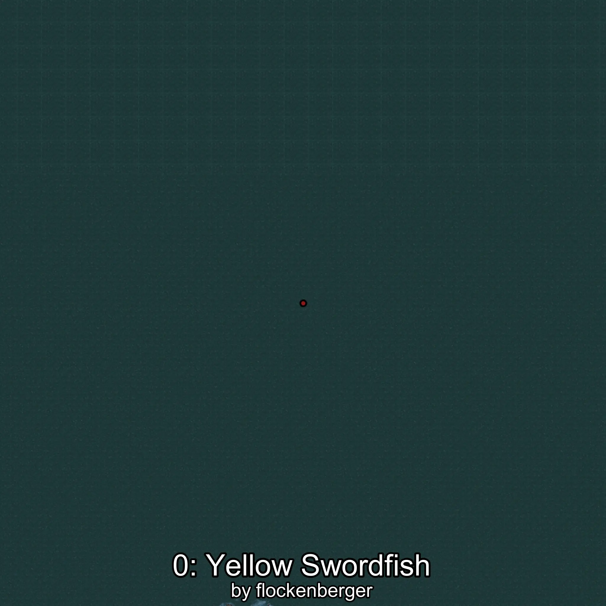

# Marlin
Creado por **flockenberger**

## ⚠️ Advertencia:
Los puntos de pesca se generan según la __**posición de tu personaje**__ — __no__ donde cae el flotador.  
En el océano especialmente, la dirección en la que lances la caña puede colocar tu flotador en una **zona de pesca diferente**, lo que puede resultar en capturar el pez incorrecto.  
Esto solo ocurre en raros casos — cuando la posición está justo en el **borde de una zona** y lanzas hacia el lado “equivocado”.

- Para verificar la posición puedes usar la guía [AQUÍ](https://flockenberger.github.io/bdo-fish-position/)
- O ver la guía [AQUÍ](https://youtu.be/t-VXcRoNojk)

## Waypoints
```xml
<!--
    Puntos de pesca para:: Marlin
    Creado por: flockenberger
-->
<WorldmapBookMark>
    <BookMark BookMarkName="0: Marlin" PosX="295517.0" PosY="-7766.0" PosZ="892596.0" />
    <BookMark BookMarkName="1: Marlin" PosX="-105474.44" PosY="-8085.94" PosZ="628456.0" />
    <BookMark BookMarkName="2: Marlin" PosX="-106708.31" PosY="-8247.982" PosZ="592275.0" />
    <BookMark BookMarkName="3: Marlin" PosX="-165720.17" PosY="-7687.8403" PosZ="855904.1" />
    <BookMark BookMarkName="4: Marlin" PosX="-120972.0" PosY="-7893.0" PosZ="791690.0" />
</WorldmapBookMark>
```

     