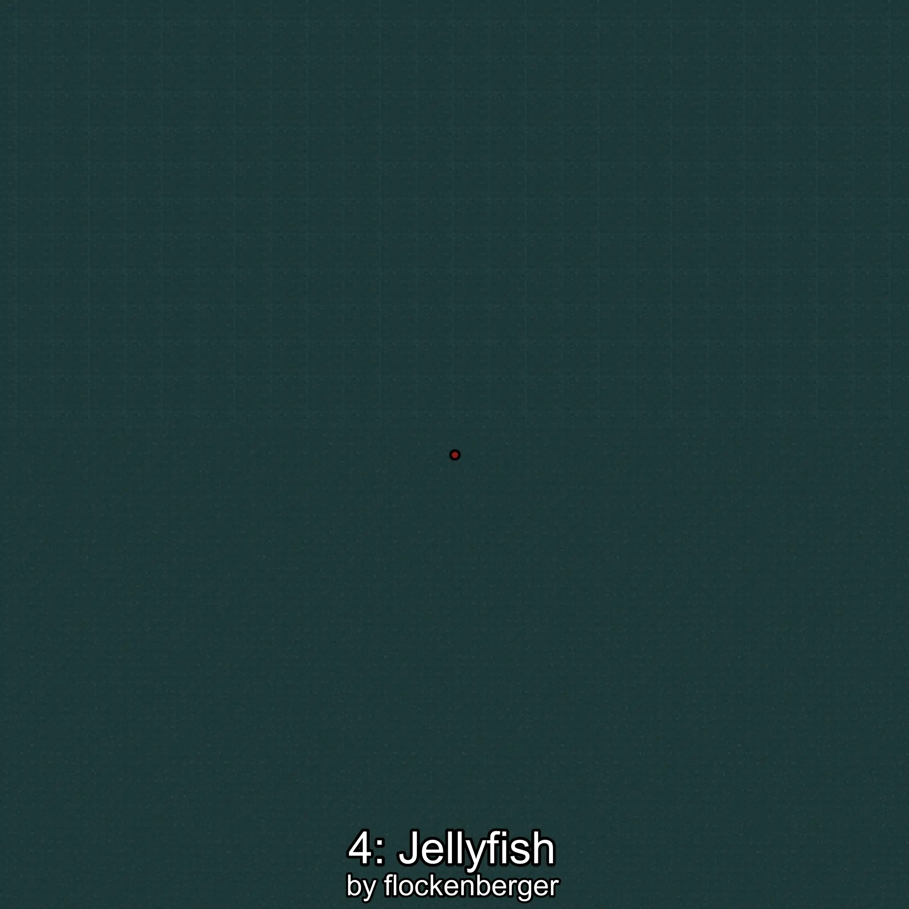

# Medusa
Creado por **flockenberger**

## ⚠️ Advertencia:
Los puntos de pesca se generan según la __**posición de tu personaje**__ — __no__ donde cae el flotador.  
En el océano especialmente, la dirección en la que lances la caña puede colocar tu flotador en una **zona de pesca diferente**, lo que puede resultar en capturar el pez incorrecto.  
Esto solo ocurre en raros casos — cuando la posición está justo en el **borde de una zona** y lanzas hacia el lado “equivocado”.

- Para verificar la posición puedes usar la guía [AQUÍ](https://flockenberger.github.io/bdo-fish-position/)
- O ver la guía [AQUÍ](https://youtu.be/t-VXcRoNojk)

## Waypoints
```xml
<!--
    Puntos de pesca para: Medusa
    Creado por: flockenberger
-->
<WorldmapBookMark>
    <BookMark BookMarkName="0: Medusa" PosX="-135087.0" PosY="-7745.0" PosZ="746279.0" />
    <BookMark BookMarkName="1: Medusa" PosX="-97199.0" PosY="-7591.0" PosZ="895106.0" />
    <BookMark BookMarkName="2: Medusa" PosX="-18887.0" PosY="-8120.0" PosZ="93507.0" />
    <BookMark BookMarkName="3: Medusa" PosX="-19030.0" PosY="-7841.0" PosZ="93123.0" />
    <BookMark BookMarkName="4: Medusa" PosX="-145688.0" PosY="-7826.0" PosZ="948974.0" />
</WorldmapBookMark>
```

     