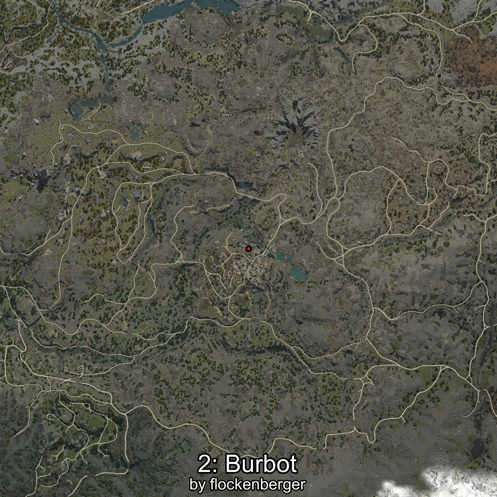

# Mokae
Creado por **flockenberger**

## ⚠️ Advertencia:
Los puntos de pesca se generan según la __**posición de tu personaje**__ — __no__ donde cae el flotador.  
En el océano especialmente, la dirección en la que lances la caña puede colocar tu flotador en una **zona de pesca diferente**, lo que puede resultar en capturar el pez incorrecto.  
Esto solo ocurre en raros casos — cuando la posición está justo en el **borde de una zona** y lanzas hacia el lado “equivocado”.

- Para verificar la posición puedes usar la guía [AQUÍ](https://flockenberger.github.io/bdo-fish-position/)
- O ver la guía [AQUÍ](https://youtu.be/t-VXcRoNojk)

## Waypoints
```xml
<!--
    Puntos de pesca para:: Mokae
    Creado por: flockenberger
-->
<WorldmapBookMark>
    <BookMark BookMarkName="0: Mokae" PosX="-51500.0" PosY="19821.0" PosZ="-396162.0" />
    <BookMark BookMarkName="1: Mokae" PosX="-50226.0" PosY="19853.0" PosZ="-396232.0" />
    <BookMark BookMarkName="2: Mokae" PosX="-50146.0" PosY="19739.0" PosZ="-395862.0" />
    <BookMark BookMarkName="3: Mokae" PosX="-49723.0" PosY="19852.0" PosZ="-396268.0" />
    <BookMark BookMarkName="4: Mokae" PosX="-51159.0" PosY="19746.0" PosZ="-396202.0" />
</WorldmapBookMark>
```

     