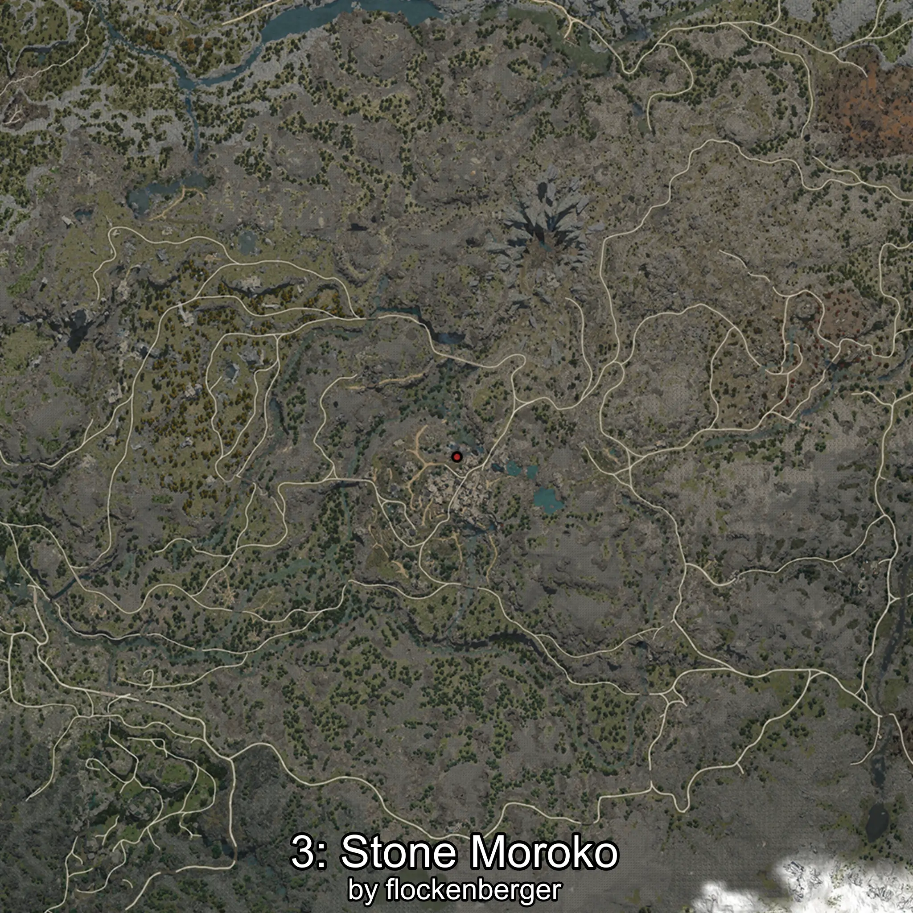

# Moroko
Creado por **flockenberger**

## ⚠️ Advertencia:
Los puntos de pesca se generan según la __**posición de tu personaje**__ — __no__ donde cae el flotador.  
En el océano especialmente, la dirección en la que lances la caña puede colocar tu flotador en una **zona de pesca diferente**, lo que puede resultar en capturar el pez incorrecto.  
Esto solo ocurre en raros casos — cuando la posición está justo en el **borde de una zona** y lanzas hacia el lado “equivocado”.

- Para verificar la posición puedes usar la guía [AQUÍ](https://flockenberger.github.io/bdo-fish-position/)
- O ver la guía [AQUÍ](https://youtu.be/t-VXcRoNojk)

## Waypoints
```xml
<!--
    Puntos de pesca para:: Moroko
    Creado por: flockenberger
-->
<WorldmapBookMark>
    <BookMark BookMarkName="0: Moroko" PosX="-50999.0" PosY="19941.0" PosZ="-396494.0" />
    <BookMark BookMarkName="1: Moroko" PosX="-32440.0" PosY="25494.0" PosZ="-402740.0" />
    <BookMark BookMarkName="2: Moroko" PosX="-50044.0" PosY="19798.0" PosZ="-395717.0" />
    <BookMark BookMarkName="3: Moroko" PosX="-50055.0" PosY="20269.0" PosZ="-396609.0" />
    <BookMark BookMarkName="4: Moroko" PosX="-51181.0" PosY="20058.0" PosZ="-396544.0" />
</WorldmapBookMark>
```

     