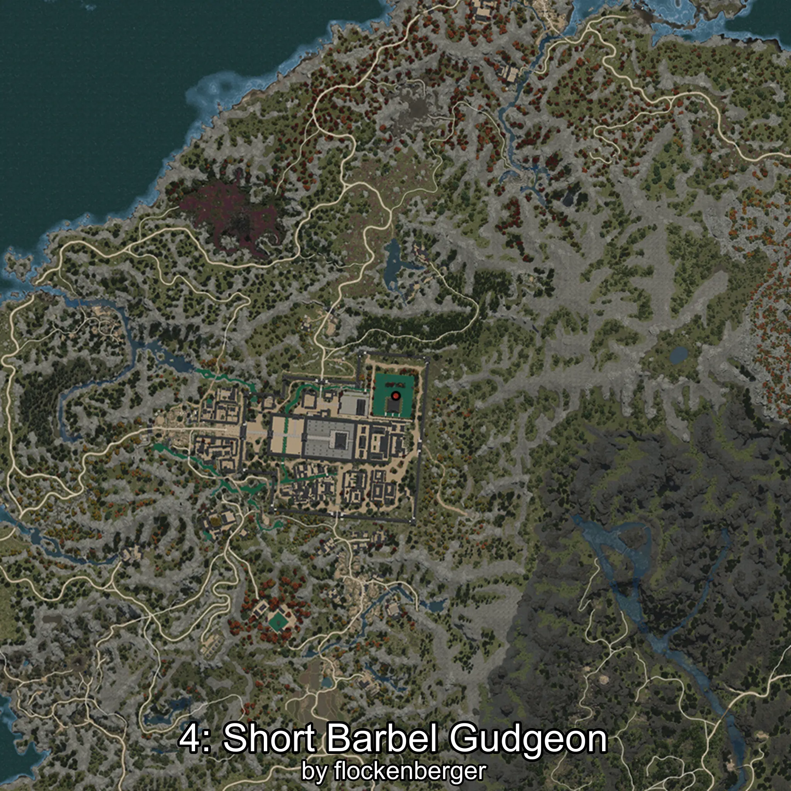

# Mulgae
Creado por **flockenberger**

## ⚠️ Advertencia:
Los puntos de pesca se generan según la __**posición de tu personaje**__ — __no__ donde cae el flotador.  
En el océano especialmente, la dirección en la que lances la caña puede colocar tu flotador en una **zona de pesca diferente**, lo que puede resultar en capturar el pez incorrecto.  
Esto solo ocurre en raros casos — cuando la posición está justo en el **borde de una zona** y lanzas hacia el lado “equivocado”.

- Para verificar la posición puedes usar la guía [AQUÍ](https://flockenberger.github.io/bdo-fish-position/)
- O ver la guía [AQUÍ](https://youtu.be/t-VXcRoNojk)

## Waypoints
```xml
<!--
    Puntos de pesca para:: Mulgae
    Creado por: flockenberger
-->
<WorldmapBookMark>
    <BookMark BookMarkName="0: Mulgae" PosX="-1184814.0" PosY="23287.002" PosZ="1314477.8" />
    <BookMark BookMarkName="1: Mulgae" PosX="-1393493.0" PosY="13186.0" PosZ="1344703.0" />
    <BookMark BookMarkName="2: Mulgae" PosX="-1396389.0" PosY="13166.0" PosZ="1354546.0" />
    <BookMark BookMarkName="3: Mulgae" PosX="-1404548.0" PosY="13171.0" PosZ="1343363.0" />
    <BookMark BookMarkName="4: Mulgae" PosX="-1396150.0" PosY="12955.0" PosZ="1350561.0" />
</WorldmapBookMark>
```

     