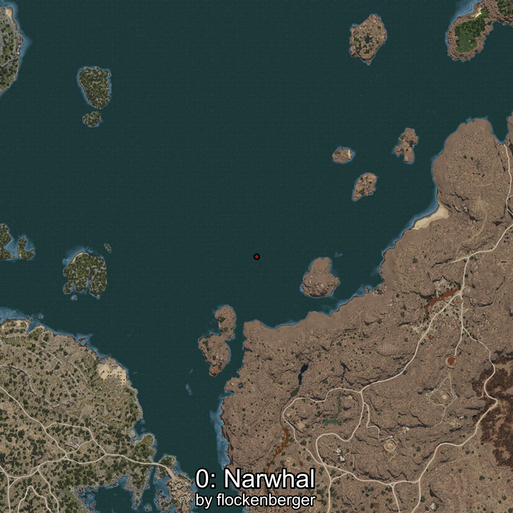

# Narval
Creado por **flockenberger**

## ⚠️ Advertencia:
Los puntos de pesca se generan según la __**posición de tu personaje**__ — __no__ donde cae el flotador.  
En el océano especialmente, la dirección en la que lances la caña puede colocar tu flotador en una **zona de pesca diferente**, lo que puede resultar en capturar el pez incorrecto.  
Esto solo ocurre en raros casos — cuando la posición está justo en el **borde de una zona** y lanzas hacia el lado “equivocado”.

- Para verificar la posición puedes usar la guía [AQUÍ](https://flockenberger.github.io/bdo-fish-position/)
- O ver la guía [AQUÍ](https://youtu.be/t-VXcRoNojk)

## Waypoints
```xml
<!--
    Puntos de pesca para: Narval
    Creado por: flockenberger
-->
<WorldmapBookMark>
    <BookMark BookMarkName="0: Narval" PosX="356148.0" PosY="-8184.0" PosZ="195610.0" />
    <BookMark BookMarkName="1: Narval" PosX="1301360.0" PosY="-8124.0" PosZ="599149.0" />
    <BookMark BookMarkName="2: Narval" PosX="1389234.0" PosY="-7868.0" PosZ="552709.0" />
    <BookMark BookMarkName="3: Narval" PosX="408646.0" PosY="-7889.0" PosZ="347711.0" />
    <BookMark BookMarkName="4: Narval" PosX="475699.0" PosY="-8170.0" PosZ="292315.0" />
</WorldmapBookMark>
```

     