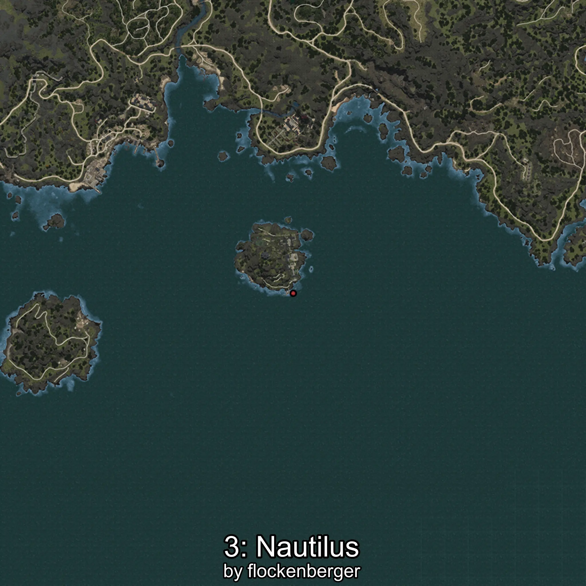

# Nautilina
Creado por **flockenberger**

## ⚠️ Advertencia:
Los puntos de pesca se generan según la __**posición de tu personaje**__ — __no__ donde cae el flotador.  
En el océano especialmente, la dirección en la que lances la caña puede colocar tu flotador en una **zona de pesca diferente**, lo que puede resultar en capturar el pez incorrecto.  
Esto solo ocurre en raros casos — cuando la posición está justo en el **borde de una zona** y lanzas hacia el lado “equivocado”.

- Para verificar la posición puedes usar la guía [AQUÍ](https://flockenberger.github.io/bdo-fish-position/)
- O ver la guía [AQUÍ](https://youtu.be/t-VXcRoNojk)

## Waypoints
```xml
<!--
    Puntos de pesca para:: Nautilina
    Creado por: flockenberger
-->
<WorldmapBookMark>
    <BookMark BookMarkName="0: Nautilina" PosX="-1319452.0" PosY="-7762.0" PosZ="1041050.0" />
    <BookMark BookMarkName="1: Nautilina" PosX="-1218468.0" PosY="-7979.0" PosZ="1051905.0" />
    <BookMark BookMarkName="2: Nautilina" PosX="-1252712.0" PosY="-7742.0" PosZ="1016164.0" />
    <BookMark BookMarkName="3: Nautilina" PosX="-1213969.0" PosY="-7759.0" PosZ="1052857.0" />
    <BookMark BookMarkName="4: Nautilina" PosX="-1230681.0" PosY="-1679.0" PosZ="1078111.0" />
</WorldmapBookMark>
```

     