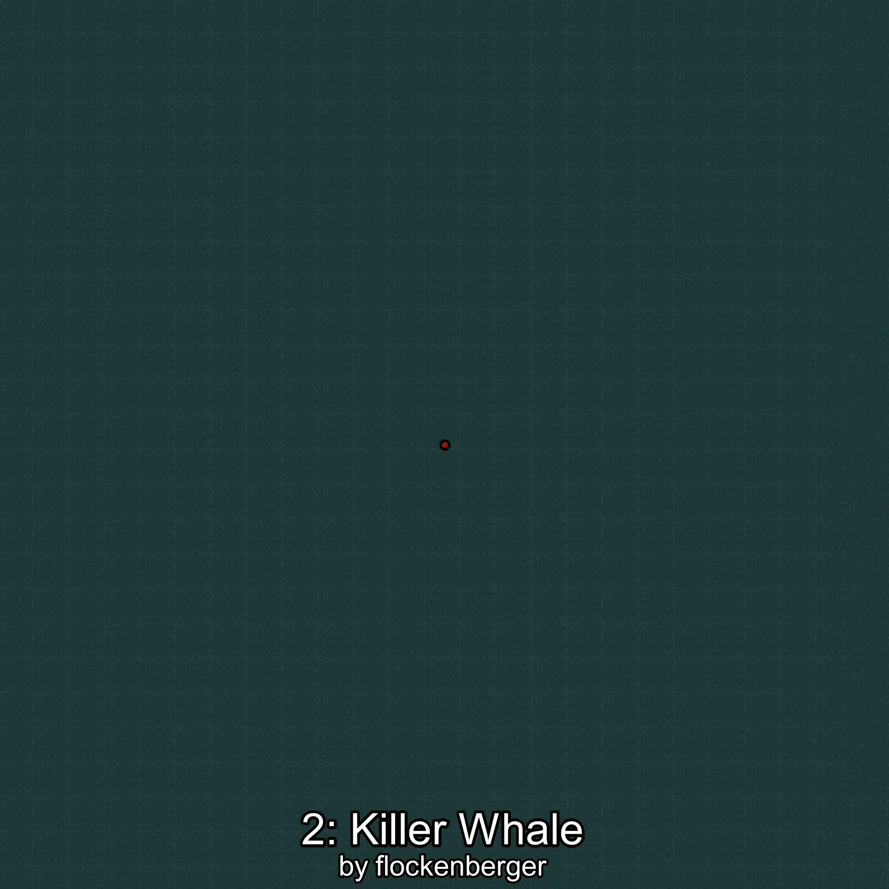
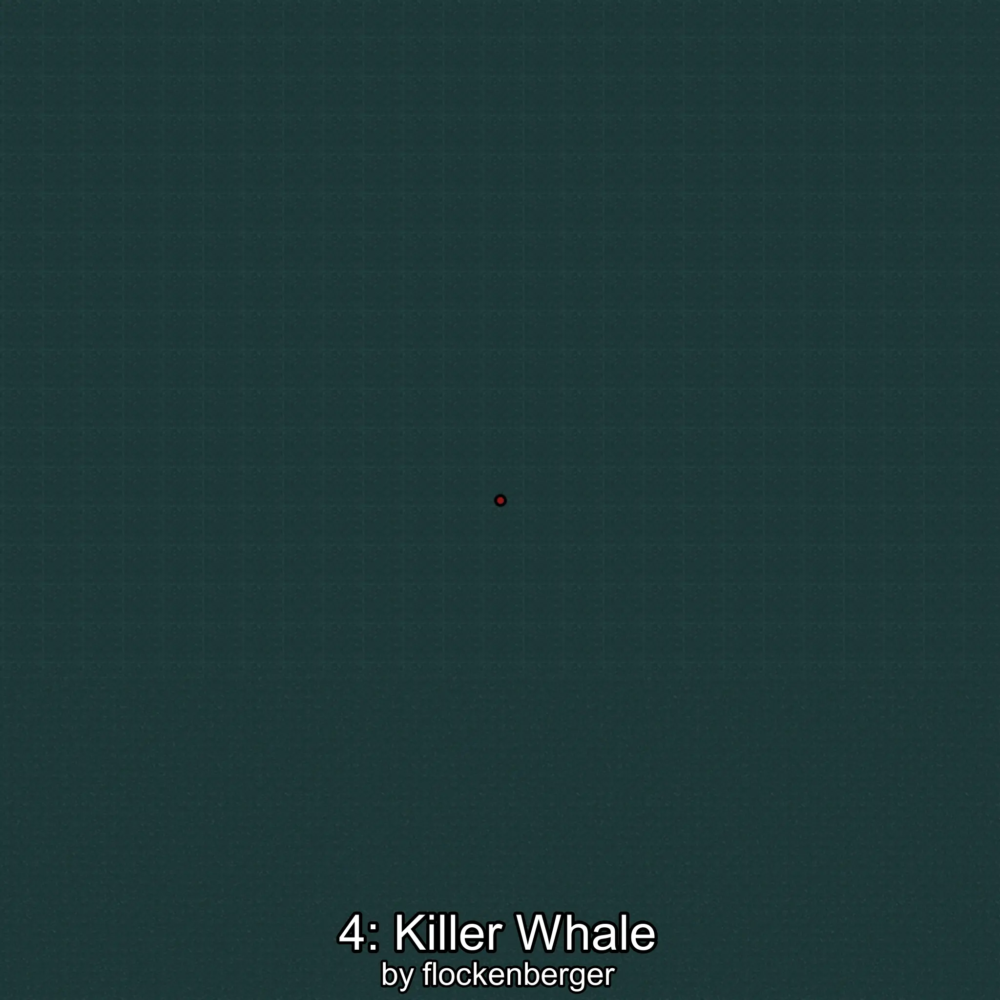

# Orca
Creado por **flockenberger**

## ⚠️ Advertencia:
Los puntos de pesca se generan según la __**posición de tu personaje**__ — __no__ donde cae el flotador.  
En el océano especialmente, la dirección en la que lances la caña puede colocar tu flotador en una **zona de pesca diferente**, lo que puede resultar en capturar el pez incorrecto.  
Esto solo ocurre en raros casos — cuando la posición está justo en el **borde de una zona** y lanzas hacia el lado “equivocado”.

- Para verificar la posición puedes usar la guía [AQUÍ](https://flockenberger.github.io/bdo-fish-position/)
- O ver la guía [AQUÍ](https://youtu.be/t-VXcRoNojk)

## Waypoints
```xml
<!--
    Puntos de pesca para:: Orca
    Creado por: flockenberger
-->
<WorldmapBookMark>
    <BookMark BookMarkName="0: Orca" PosX="21823.0" PosY="-7587.0" PosZ="1299297.0" />
    <BookMark BookMarkName="1: Orca" PosX="80417.0" PosY="-8126.0" PosZ="290898.0" />
    <BookMark BookMarkName="2: Orca" PosX="-892617.0" PosY="-7907.0" PosZ="723851.0" />
    <BookMark BookMarkName="3: Orca" PosX="-456704.0" PosY="-7779.0" PosZ="989225.0" />
    <BookMark BookMarkName="4: Orca" PosX="-301689.0" PosY="-8194.0" PosZ="1013160.0" />
</WorldmapBookMark>
```

     