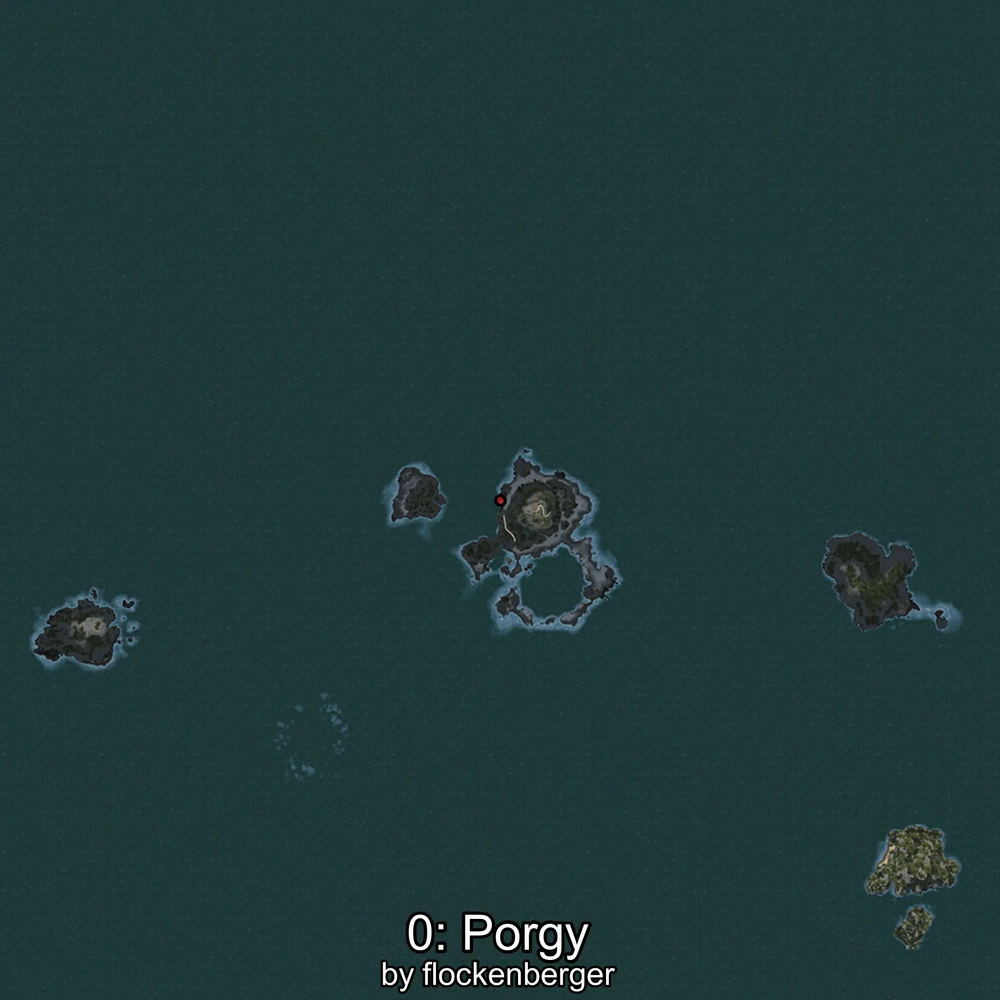

# Pargo
Creado por **flockenberger**

## ⚠️ Advertencia:
Los puntos de pesca se generan según la __**posición de tu personaje**__ — __no__ donde cae el flotador.  
En el océano especialmente, la dirección en la que lances la caña puede colocar tu flotador en una **zona de pesca diferente**, lo que puede resultar en capturar el pez incorrecto.  
Esto solo ocurre en raros casos — cuando la posición está justo en el **borde de una zona** y lanzas hacia el lado “equivocado”.

- Para verificar la posición puedes usar la guía [AQUÍ](https://flockenberger.github.io/bdo-fish-position/)
- O ver la guía [AQUÍ](https://youtu.be/t-VXcRoNojk)

## Waypoints
```xml
<!--
    Puntos de pesca para:: Pargo
    Creado por: flockenberger
-->
<WorldmapBookMark>
    <BookMark BookMarkName="0: Pargo" PosX="-105610.0" PosY="-8133.0" PosZ="628583.0" />
    <BookMark BookMarkName="1: Pargo" PosX="-106688.0" PosY="-7640.0" PosZ="630970.0" />
    <BookMark BookMarkName="2: Pargo" PosX="-105801.0" PosY="-8266.0" PosZ="628899.0" />
    <BookMark BookMarkName="3: Pargo" PosX="-105662.0" PosY="-8141.0" PosZ="628446.0" />
    <BookMark BookMarkName="4: Pargo" PosX="-308774.97" PosY="-7731.7476" PosZ="360860.0" />
</WorldmapBookMark>
```

     