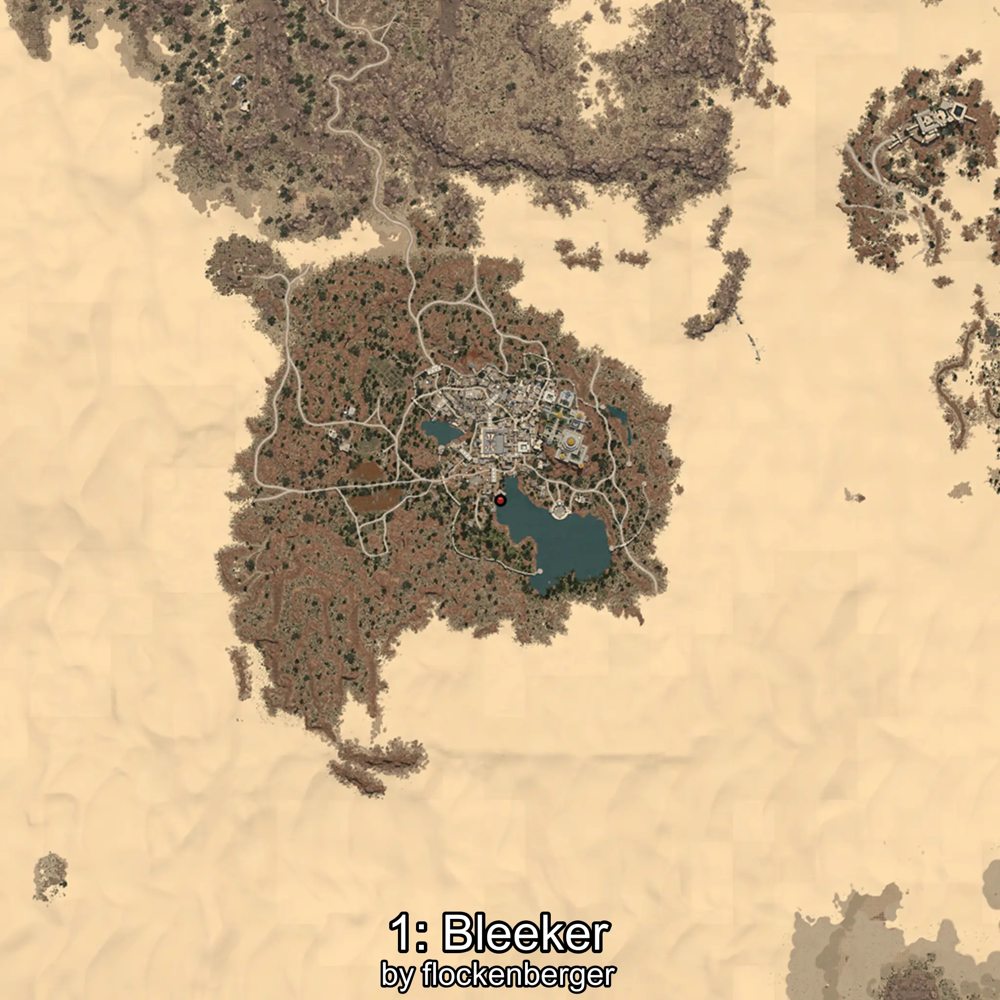

# Phoxinus
Creado por **flockenberger**

## ⚠️ Advertencia:
Los puntos de pesca se generan según la __**posición de tu personaje**__ — __no__ donde cae el flotador.  
En el océano especialmente, la dirección en la que lances la caña puede colocar tu flotador en una **zona de pesca diferente**, lo que puede resultar en capturar el pez incorrecto.  
Esto solo ocurre en raros casos — cuando la posición está justo en el **borde de una zona** y lanzas hacia el lado “equivocado”.

- Para verificar la posición puedes usar la guía [AQUÍ](https://flockenberger.github.io/bdo-fish-position/)
- O ver la guía [AQUÍ](https://youtu.be/t-VXcRoNojk)

## Waypoints
```xml
<!--
    Puntos de pesca para: Phoxinus
    Creado por: flockenberger
-->
<WorldmapBookMark>
    <BookMark BookMarkName="0: Phoxinus" PosX="1015085.0" PosY="9296.0" PosZ="204034.0" />
    <BookMark BookMarkName="1: Phoxinus" PosX="1028528.0" PosY="10457.0" PosZ="181543.0" />
    <BookMark BookMarkName="2: Phoxinus" PosX="397068.0" PosY="-7060.0" PosZ="95945.0" />
    <BookMark BookMarkName="3: Phoxinus" PosX="319565.0" PosY="-7296.0" PosZ="-177012.0" />
    <BookMark BookMarkName="4: Phoxinus" PosX="574340.0" PosY="-794.0" PosZ="277103.0" />
</WorldmapBookMark>
```

     