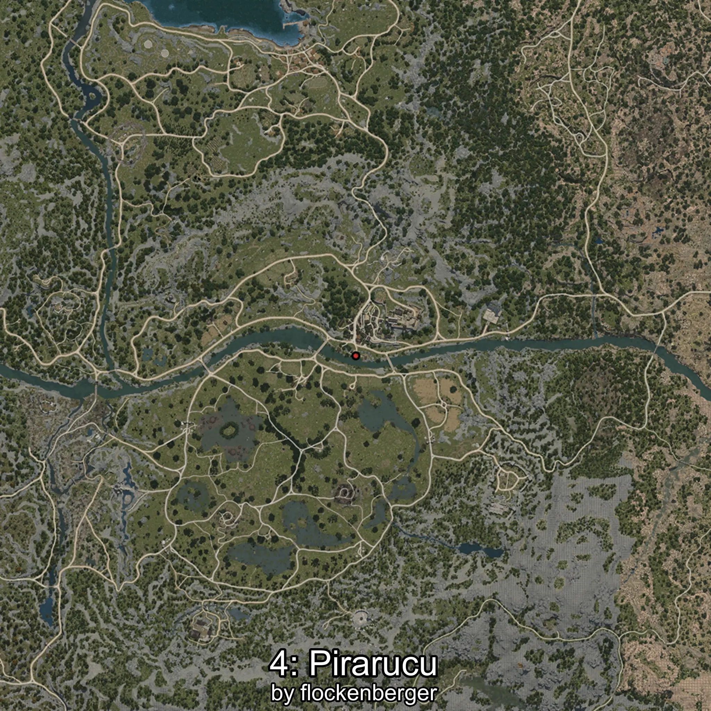

# Pirarucú
Creado por **flockenberger**

## ⚠️ Advertencia:
Los puntos de pesca se generan según la __**posición de tu personaje**__ — __no__ donde cae el flotador.  
En el océano especialmente, la dirección en la que lances la caña puede colocar tu flotador en una **zona de pesca diferente**, lo que puede resultar en capturar el pez incorrecto.  
Esto solo ocurre en raros casos — cuando la posición está justo en el **borde de una zona** y lanzas hacia el lado “equivocado”.

- Para verificar la posición puedes usar la guía [AQUÍ](https://flockenberger.github.io/bdo-fish-position/)
- O ver la guía [AQUÍ](https://youtu.be/t-VXcRoNojk)

## Waypoints
```xml
<!--
    Puntos de pesca para:: Pirarucú
    Creado por: flockenberger
-->
<WorldmapBookMark>
    <BookMark BookMarkName="0: Pirarucú" PosX="40481.0" PosY="-3344.0" PosZ="-51788.0" />
    <BookMark BookMarkName="1: Pirarucú" PosX="40255.0" PosY="-3825.0" PosZ="-52375.0" />
    <BookMark BookMarkName="2: Pirarucú" PosX="40480.0" PosY="-3458.0" PosZ="-51744.0" />
    <BookMark BookMarkName="3: Pirarucú" PosX="39187.0" PosY="-4026.0" PosZ="-51042.0" />
    <BookMark BookMarkName="4: Pirarucú" PosX="37734.0" PosY="-3585.0" PosZ="-50557.0" />
</WorldmapBookMark>
```

     