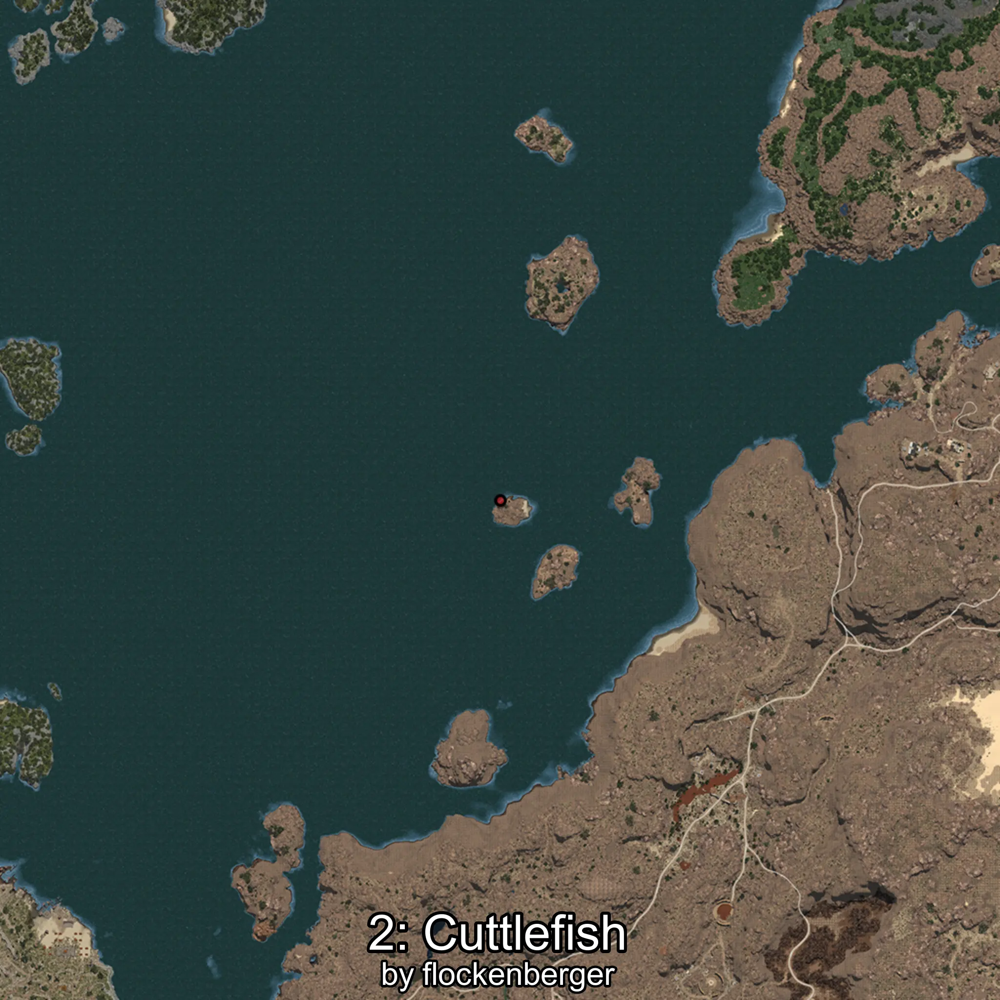

# Sepia
Creado por **flockenberger**

## ⚠️ Advertencia:
Los puntos de pesca se generan según la __**posición de tu personaje**__ — __no__ donde cae el flotador.  
En el océano especialmente, la dirección en la que lances la caña puede colocar tu flotador en una **zona de pesca diferente**, lo que puede resultar en capturar el pez incorrecto.  
Esto solo ocurre en raros casos — cuando la posición está justo en el **borde de una zona** y lanzas hacia el lado “equivocado”.

- Para verificar la posición puedes usar la guía [AQUÍ](https://flockenberger.github.io/bdo-fish-position/)
- O ver la guía [AQUÍ](https://youtu.be/t-VXcRoNojk)

## Waypoints
```xml
<!--
    Puntos de pesca para:: Sepia
    Creado por: flockenberger
-->
<WorldmapBookMark>
    <BookMark BookMarkName="0: Sepia" PosX="1265430.0" PosY="-7870.0" PosZ="548467.0" />
    <BookMark BookMarkName="1: Sepia" PosX="1415240.0" PosY="-7910.0" PosZ="290589.0" />
    <BookMark BookMarkName="2: Sepia" PosX="403931.0" PosY="-7988.0" PosZ="259647.0" />
    <BookMark BookMarkName="3: Sepia" PosX="406503.0" PosY="-8173.0" PosZ="261761.0" />
    <BookMark BookMarkName="4: Sepia" PosX="-105299.0" PosY="-7977.0" PosZ="634306.0" />
</WorldmapBookMark>
```

     