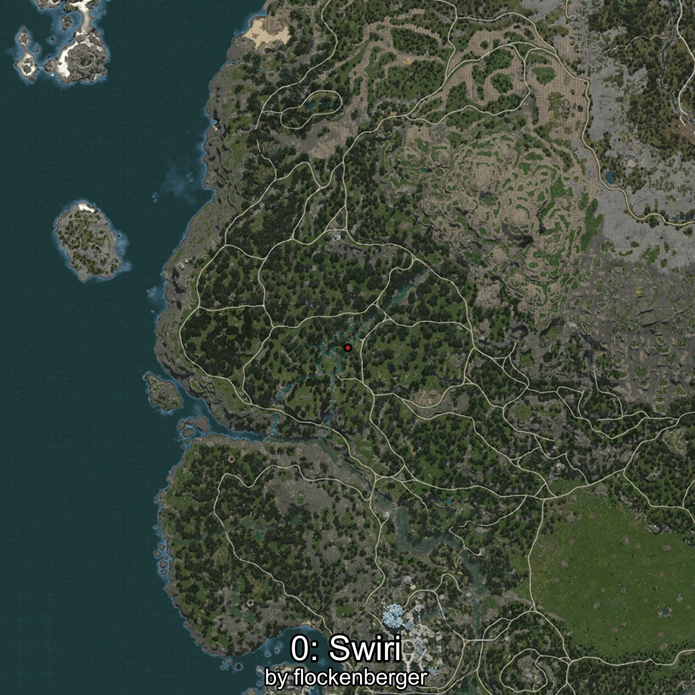
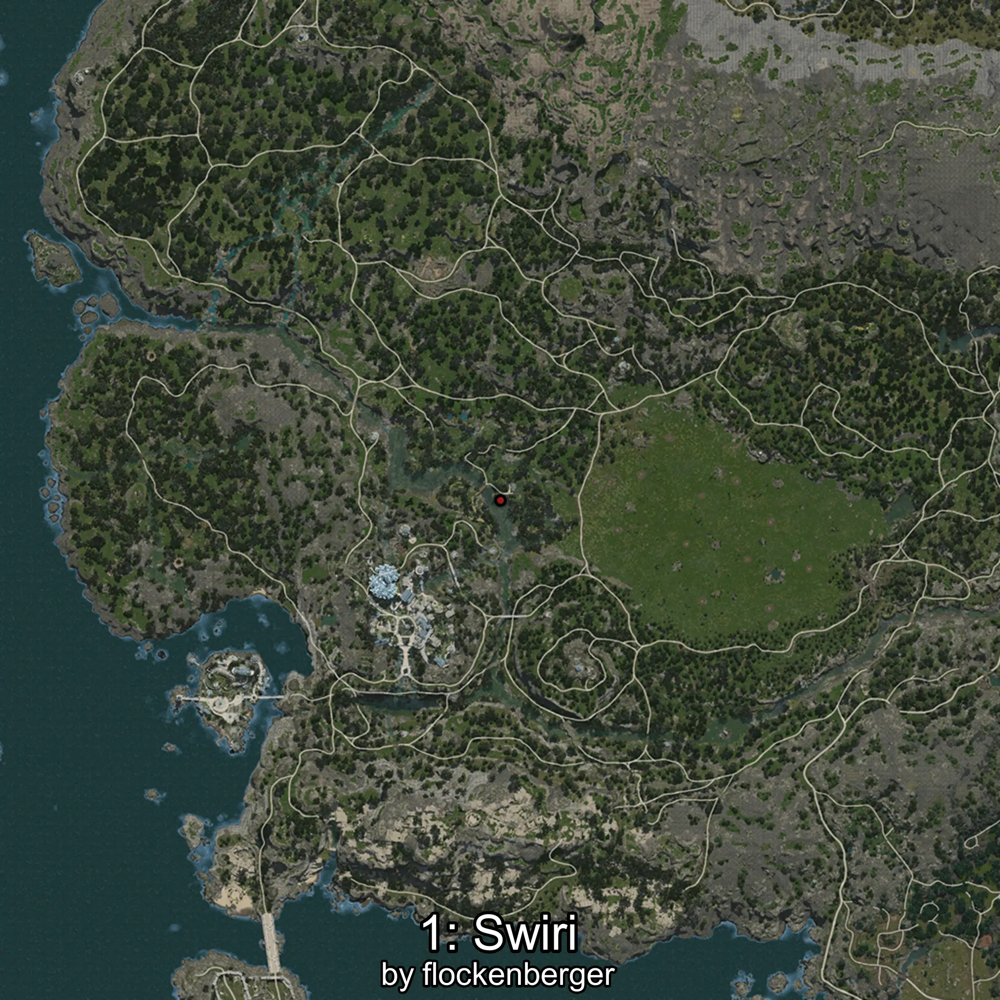
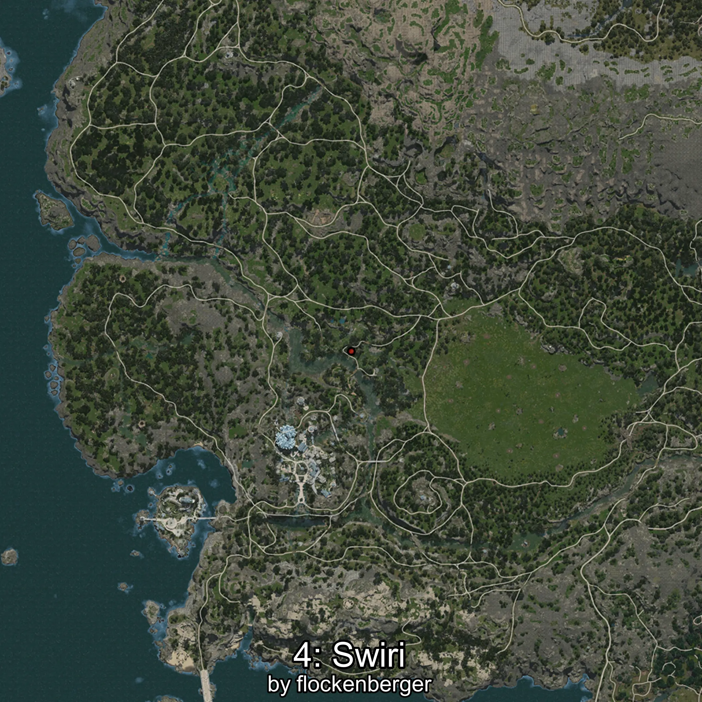

# Swiri
Creado por **flockenberger**

## ⚠️ Advertencia:
Los puntos de pesca se generan según la __**posición de tu personaje**__ — __no__ donde cae el flotador.  
En el océano especialmente, la dirección en la que lances la caña puede colocar tu flotador en una **zona de pesca diferente**, lo que puede resultar en capturar el pez incorrecto.  
Esto solo ocurre en raros casos — cuando la posición está justo en el **borde de una zona** y lanzas hacia el lado “equivocado”.

- Para verificar la posición puedes usar la guía [AQUÍ](https://flockenberger.github.io/bdo-fish-position/)
- O ver la guía [AQUÍ](https://youtu.be/t-VXcRoNojk)

## Waypoints
```xml
<!--
    Puntos de pesca para:: Swiri
    Creado por: flockenberger
-->
<WorldmapBookMark>
    <BookMark BookMarkName="0: Swiri" PosX="-531947.0" PosY="10421.0" PosZ="-326041.0" />
    <BookMark BookMarkName="1: Swiri" PosX="-475867.0" PosY="-4794.0" PosZ="-420080.0" />
    <BookMark BookMarkName="2: Swiri" PosX="-486994.0" PosY="-4718.0" PosZ="-414165.0" />
    <BookMark BookMarkName="3: Swiri" PosX="-496583.0" PosY="-4818.0" PosZ="-411561.0" />
    <BookMark BookMarkName="4: Swiri" PosX="-483263.0" PosY="-4871.0" PosZ="-407483.0" />
</WorldmapBookMark>
```

     