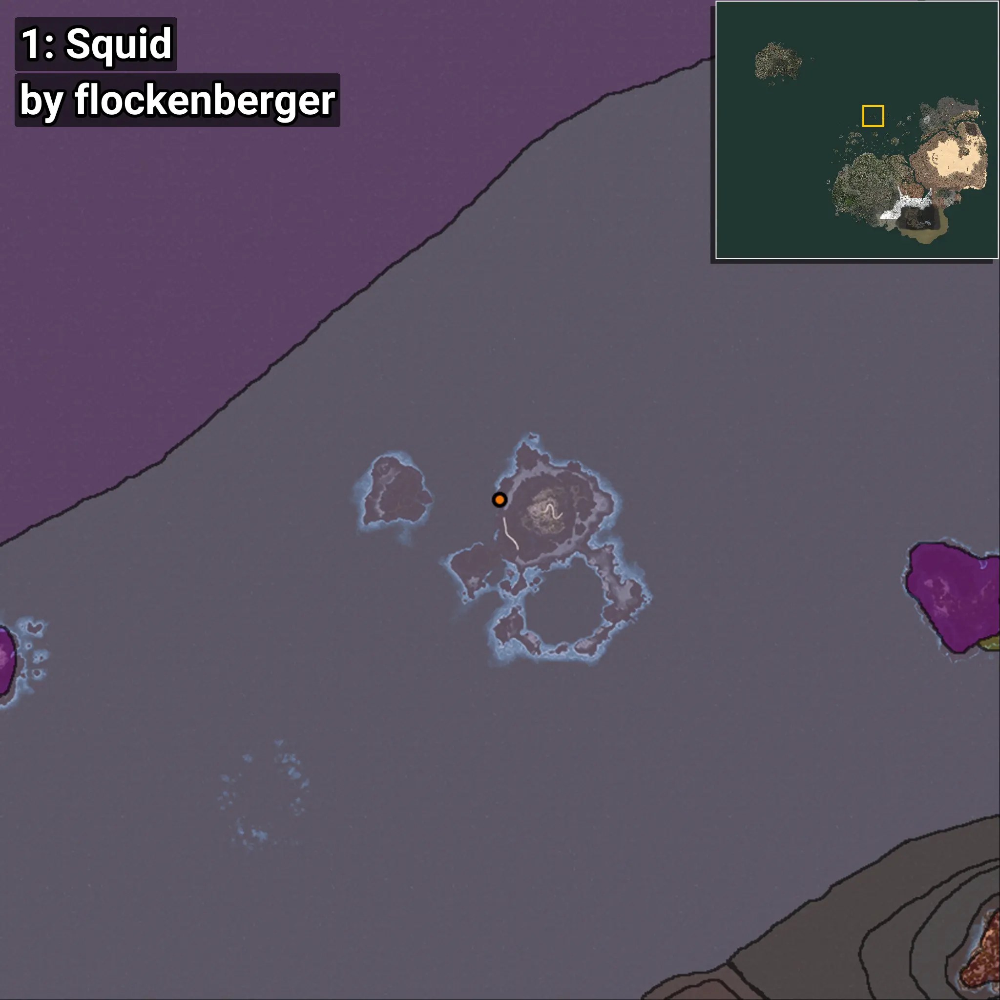
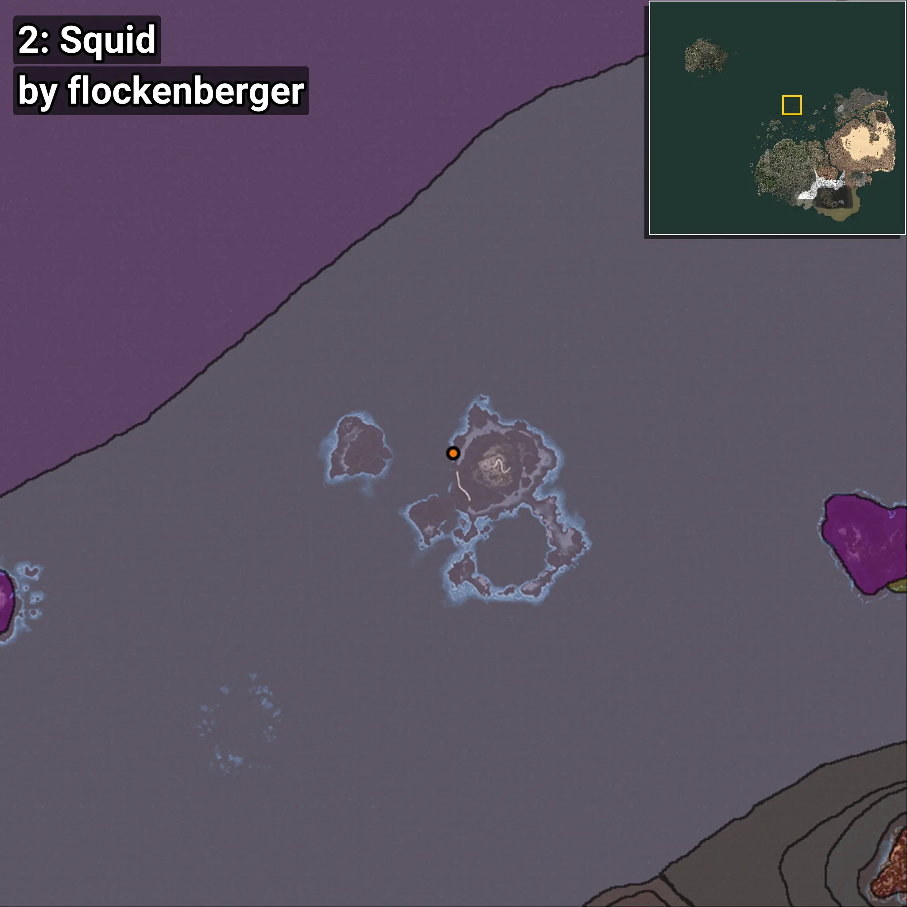
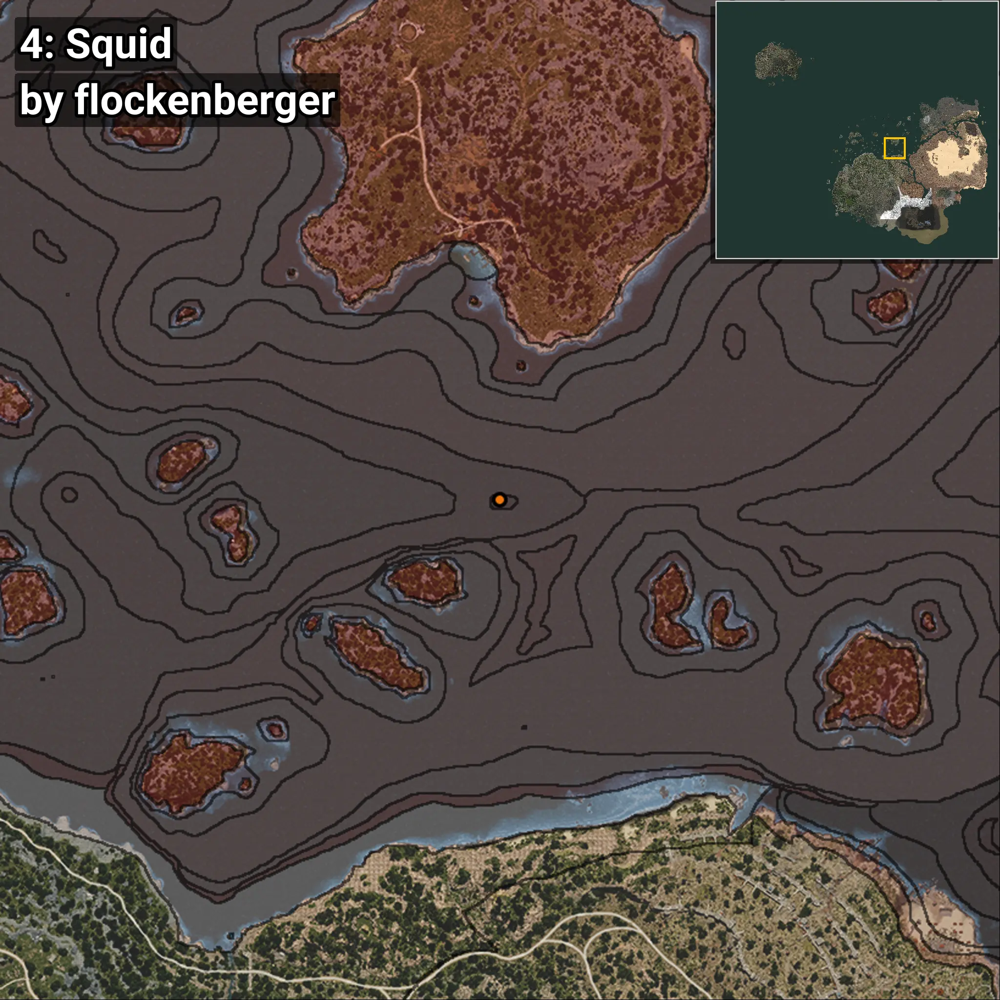
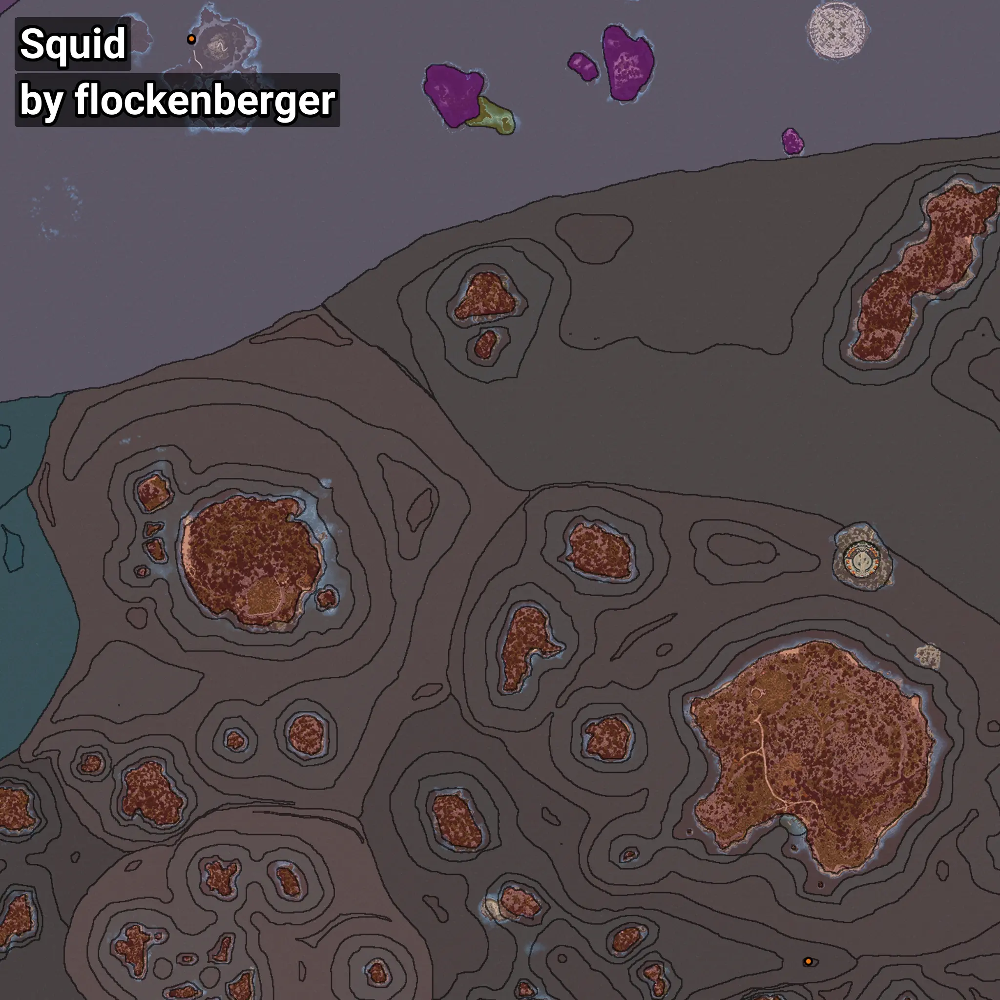

# Squid
```xml
<!--
    Waypoints for: Squid
    Created by: flockenberger
-->
<WorldmapBookMark>
    <BookMark BookMarkName="0: Squid" PosX="-105527.586" PosY="-8102.748" PosZ="628462.75" />
    <BookMark BookMarkName="1: Squid" PosX="-105545.0" PosY="-8109.0" PosZ="628475.0" />
    <BookMark BookMarkName="2: Squid" PosX="-105595.0" PosY="-8168.0" PosZ="629002.0" />
    <BookMark BookMarkName="3: Squid" PosX="-105513.0" PosY="-8144.0" PosZ="628983.0" />
    <BookMark BookMarkName="4: Squid" PosX="160666.0" PosY="-8180.0" PosZ="230970.0" />
</WorldmapBookMark>
```

## ⚠️ Disclaimer
Waypoints are generated based on the __**character’s position**__ — __not__ where the fishing float landed.
Fish are determined by where your **float** lands!
In ocean spots especially, the direction you cast your rod can place your float in a **different fishing zone**, which may result in catching the wrong type of fish.
Please pay attention to the preview images showing where each location is in relation to the outlined zones.

- You can verify your float’s position using the guide [**HERE**](https://flockenberger.github.io/bdo-fish-position/)
- Or watch the video guide [**HERE**](https://youtu.be/t-VXcRoNojk)

## Previews
      