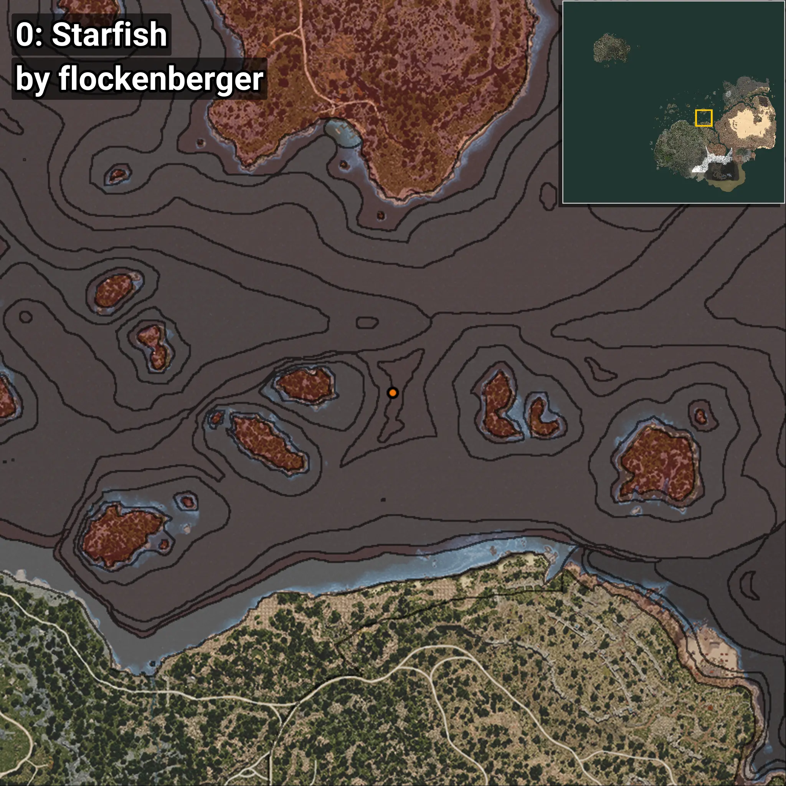
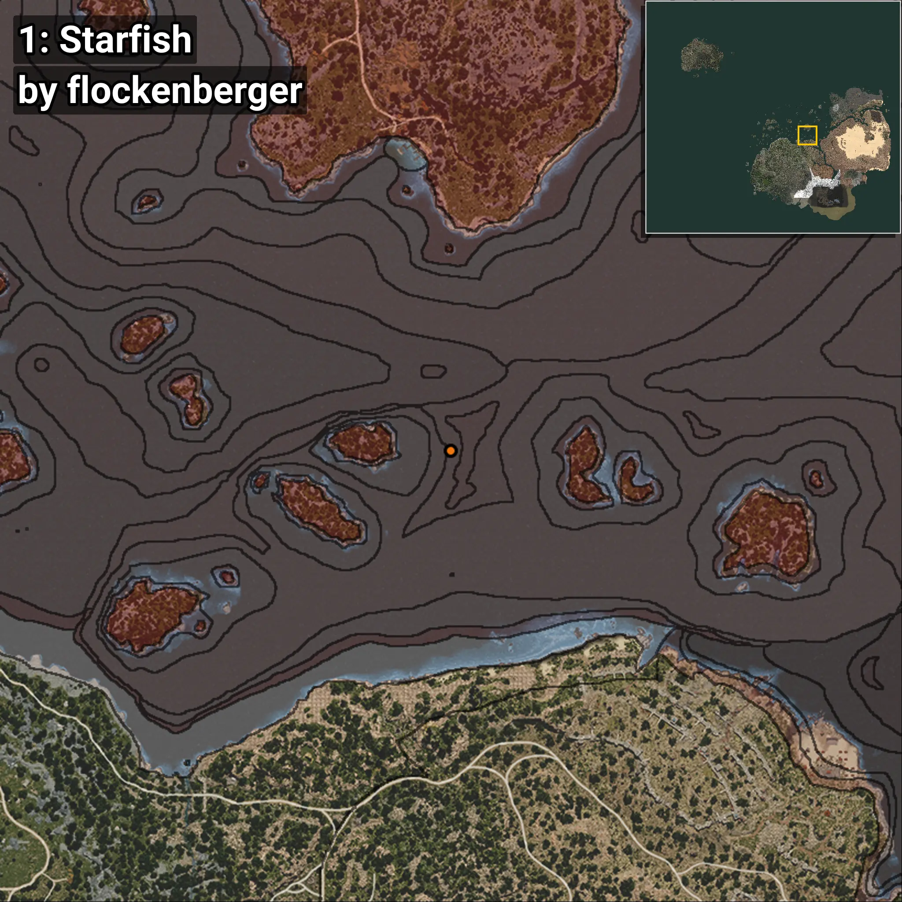
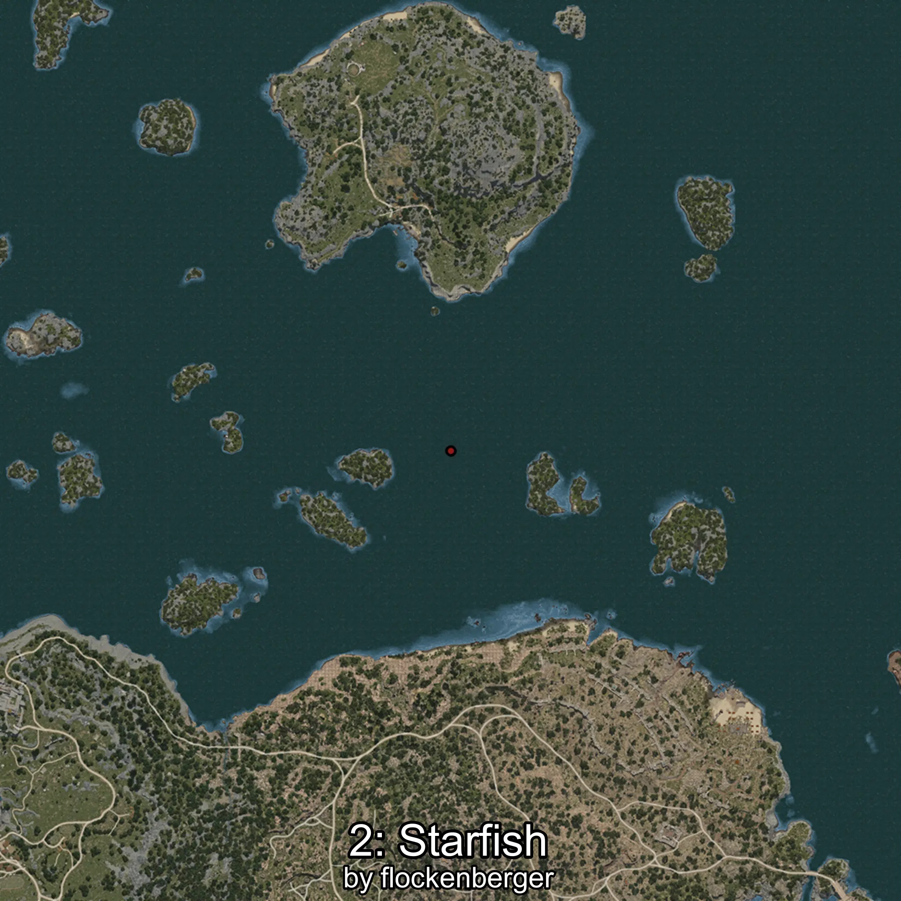
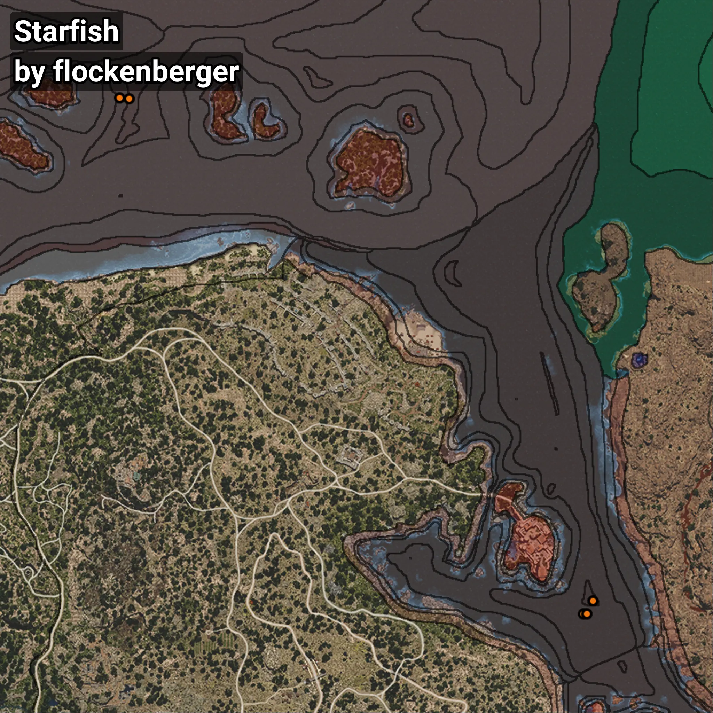

# Starfish
```xml
<!--
    Waypoints for: Starfish
    Created by: flockenberger
-->
<WorldmapBookMark>
    <BookMark BookMarkName="0: Starfish" PosX="169823.39" PosY="-7751.111" PosZ="208405.42" />
    <BookMark BookMarkName="1: Starfish" PosX="166361.0" PosY="-8008.0" PosZ="208469.0" />
    <BookMark BookMarkName="2: Starfish" PosX="326963.5" PosY="-7038.132" PosZ="30075.086" />
    <BookMark BookMarkName="3: Starfish" PosX="328121.0" PosY="-7928.0" PosZ="29900.0" />
    <BookMark BookMarkName="4: Starfish" PosX="330325.0" PosY="-7890.0" PosZ="34511.0" />
</WorldmapBookMark>
```

## ⚠️ Disclaimer
Waypoints are generated based on the __**character’s position**__ — __not__ where the fishing float landed.
Fish are determined by where your **float** lands!
In ocean spots especially, the direction you cast your rod can place your float in a **different fishing zone**, which may result in catching the wrong type of fish.
Please pay attention to the preview images showing where each location is in relation to the outlined zones.

- You can verify your float’s position using the guide [**HERE**](https://flockenberger.github.io/bdo-fish-position/)
- Or watch the video guide [**HERE**](https://youtu.be/t-VXcRoNojk)

## Previews
      