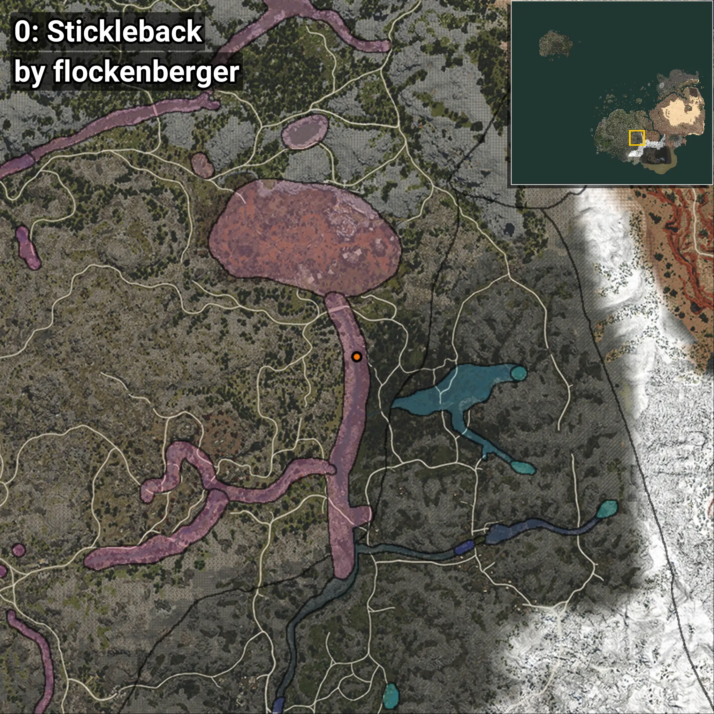
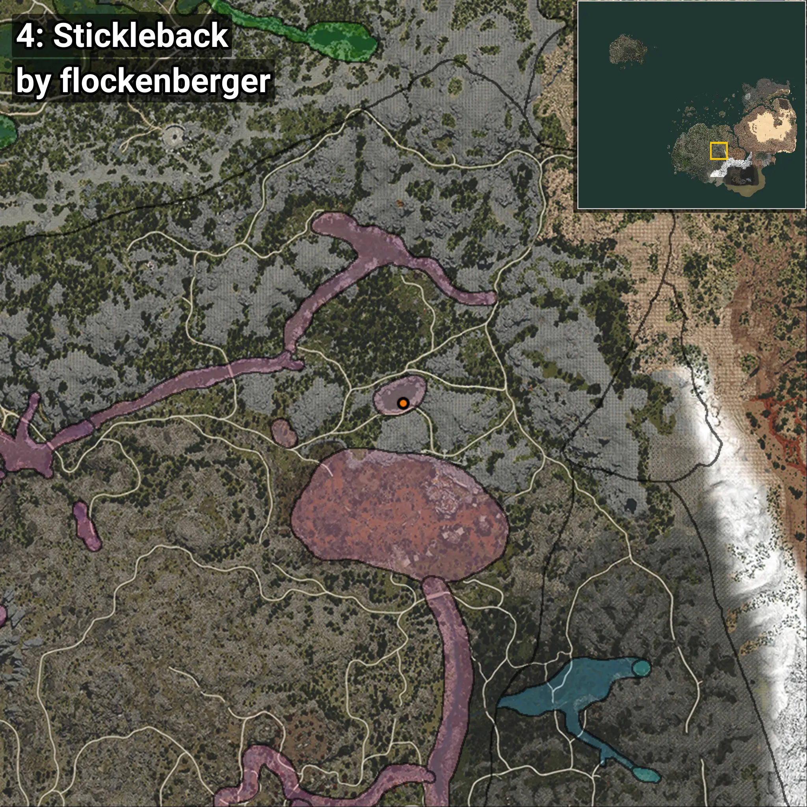

# Stickleback
```xml
<!--
    Waypoints for: Stickleback
    Created by: flockenberger
-->
<WorldmapBookMark>
    <BookMark BookMarkName="0: Stickleback" PosX="126826.0" PosY="9285.0" PosZ="-321238.0" />
    <BookMark BookMarkName="1: Stickleback" PosX="115611.02" PosY="14631.538" PosZ="-359190.62" />
    <BookMark BookMarkName="2: Stickleback" PosX="114137.0" PosY="10995.0" PosZ="-204761.0" />
    <BookMark BookMarkName="3: Stickleback" PosX="106230.0" PosY="14954.0" PosZ="-357626.0" />
    <BookMark BookMarkName="4: Stickleback" PosX="110046.484" PosY="7114.9224" PosZ="-245897.1" />
</WorldmapBookMark>
```

## ⚠️ Disclaimer
Waypoints are generated based on the __**character’s position**__ — __not__ where the fishing float landed.
Fish are determined by where your **float** lands!
In ocean spots especially, the direction you cast your rod can place your float in a **different fishing zone**, which may result in catching the wrong type of fish.
Please pay attention to the preview images showing where each location is in relation to the outlined zones.

- You can verify your float’s position using the guide [**HERE**](https://flockenberger.github.io/bdo-fish-position/)
- Or watch the video guide [**HERE**](https://youtu.be/t-VXcRoNojk)

## Previews
      