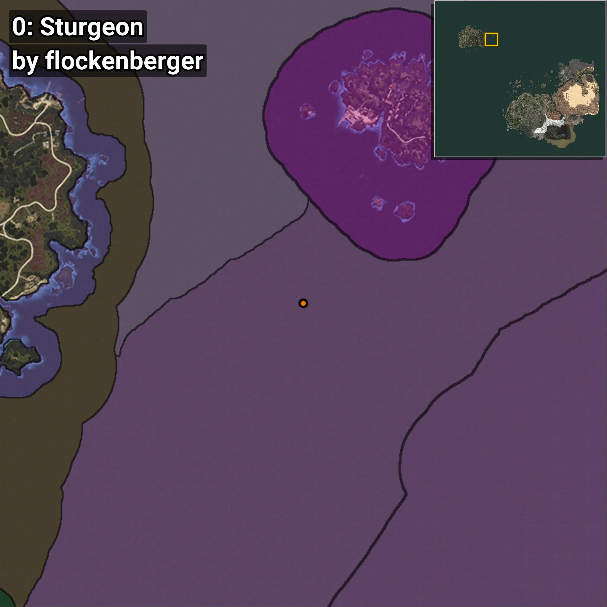
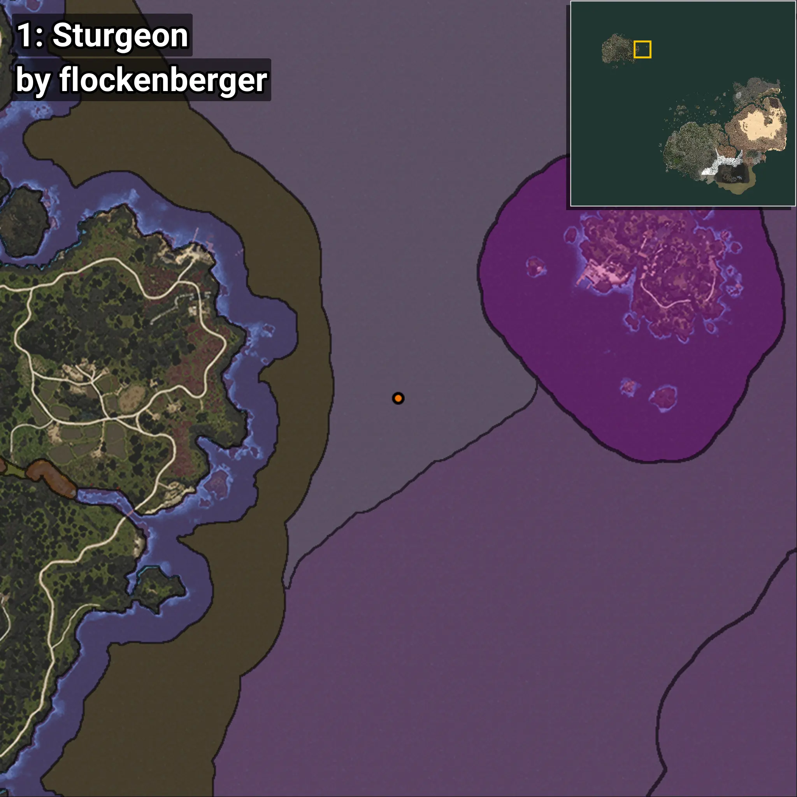
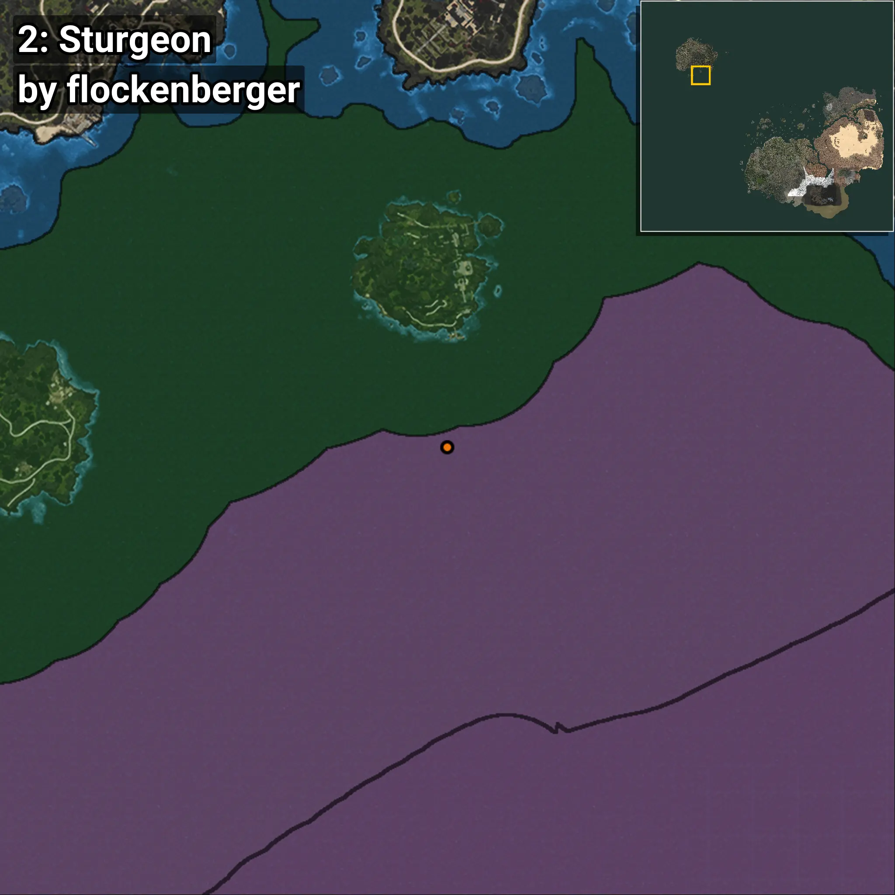
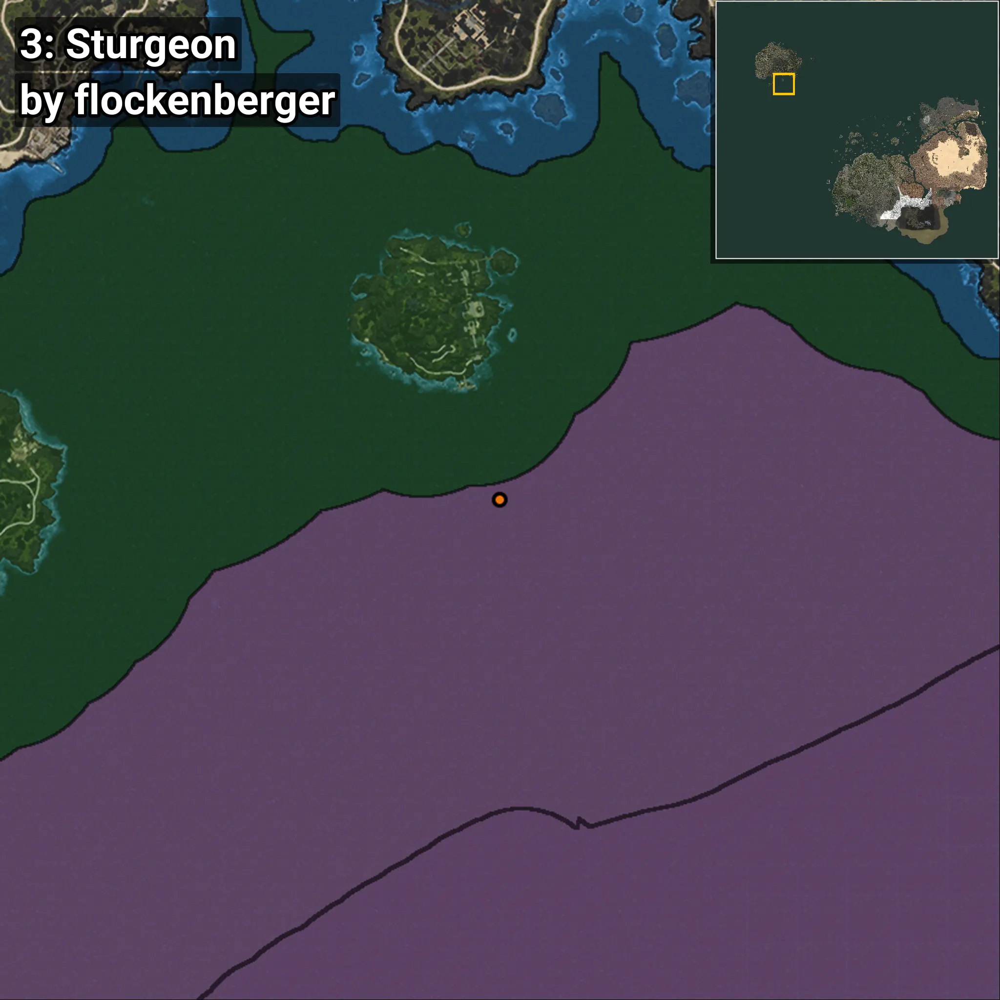
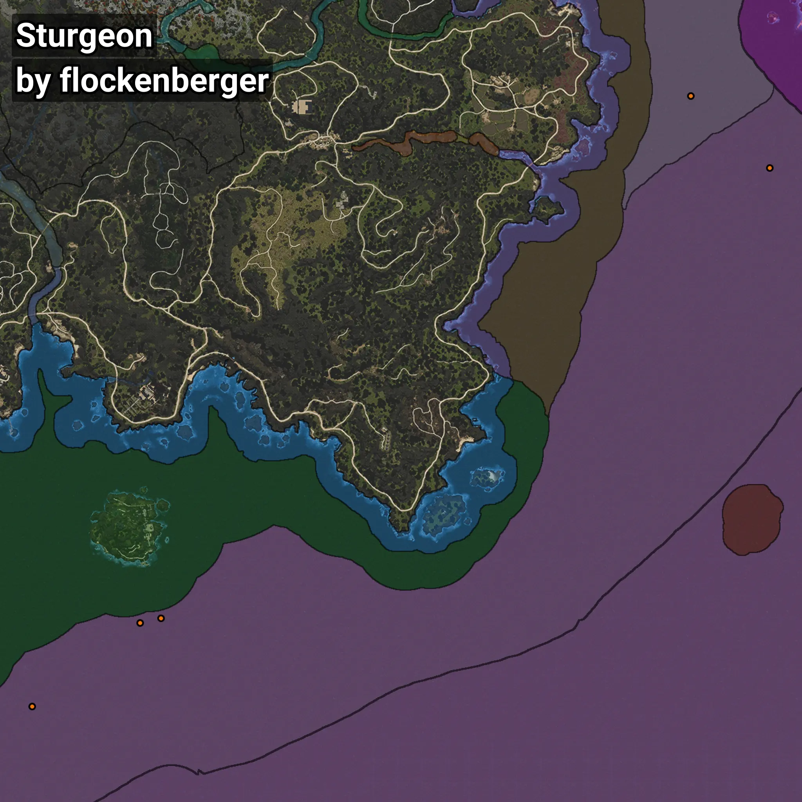

# Sturgeon
```xml
<!--
    Waypoints for: Sturgeon
    Created by: flockenberger
-->
<WorldmapBookMark>
    <BookMark BookMarkName="0: Sturgeon" PosX="-891736.44" PosY="-8128.6416" PosZ="1258594.9" />
    <BookMark BookMarkName="1: Sturgeon" PosX="-932668.0" PosY="-7991.0" PosZ="1295773.0" />
    <BookMark BookMarkName="2: Sturgeon" PosX="-1218442.0" PosY="-7798.0" PosZ="1022357.0" />
    <BookMark BookMarkName="3: Sturgeon" PosX="-1207541.0" PosY="-8124.0" PosZ="1024726.0" />
    <BookMark BookMarkName="4: Sturgeon" PosX="-1274300.0" PosY="-7884.0" PosZ="979107.0" />
</WorldmapBookMark>
```

## ⚠️ Disclaimer
Waypoints are generated based on the __**character’s position**__ — __not__ where the fishing float landed.
Fish are determined by where your **float** lands!
In ocean spots especially, the direction you cast your rod can place your float in a **different fishing zone**, which may result in catching the wrong type of fish.
Please pay attention to the preview images showing where each location is in relation to the outlined zones.

- You can verify your float’s position using the guide [**HERE**](https://flockenberger.github.io/bdo-fish-position/)
- Or watch the video guide [**HERE**](https://youtu.be/t-VXcRoNojk)

## Previews
      