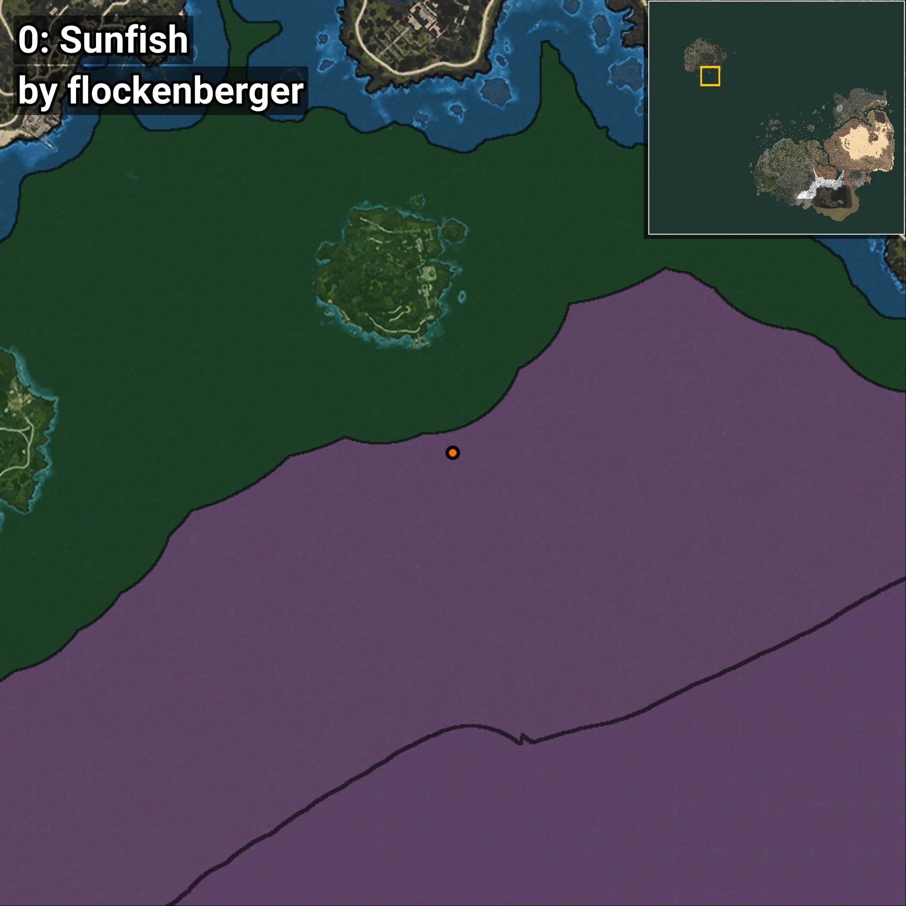
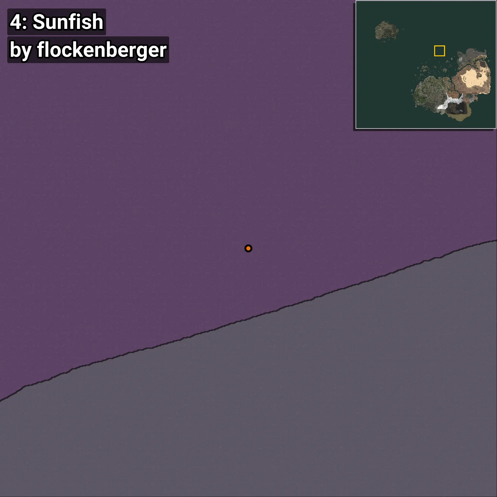

# Sunfish
```xml
<!--
    Waypoints for: Sunfish
    Created by: flockenberger
-->
<WorldmapBookMark>
    <BookMark BookMarkName="0: Sunfish" PosX="-1206884.4" PosY="-7895.2705" PosZ="1022982.44" />
    <BookMark BookMarkName="1: Sunfish" PosX="-1208395.0" PosY="-7914.0" PosZ="1014884.0" />
    <BookMark BookMarkName="2: Sunfish" PosX="-105472.0" PosY="-7977.0" PosZ="634293.0" />
    <BookMark BookMarkName="3: Sunfish" PosX="-105355.0" PosY="-7975.0" PosZ="634232.0" />
    <BookMark BookMarkName="4: Sunfish" PosX="31713.58" PosY="-8208.0" PosZ="796799.9" />
</WorldmapBookMark>
```

## ⚠️ Disclaimer
Waypoints are generated based on the __**character’s position**__ — __not__ where the fishing float landed.
Fish are determined by where your **float** lands!
In ocean spots especially, the direction you cast your rod can place your float in a **different fishing zone**, which may result in catching the wrong type of fish.
Please pay attention to the preview images showing where each location is in relation to the outlined zones.

- You can verify your float’s position using the guide [**HERE**](https://flockenberger.github.io/bdo-fish-position/)
- Or watch the video guide [**HERE**](https://youtu.be/t-VXcRoNojk)

## Previews
      