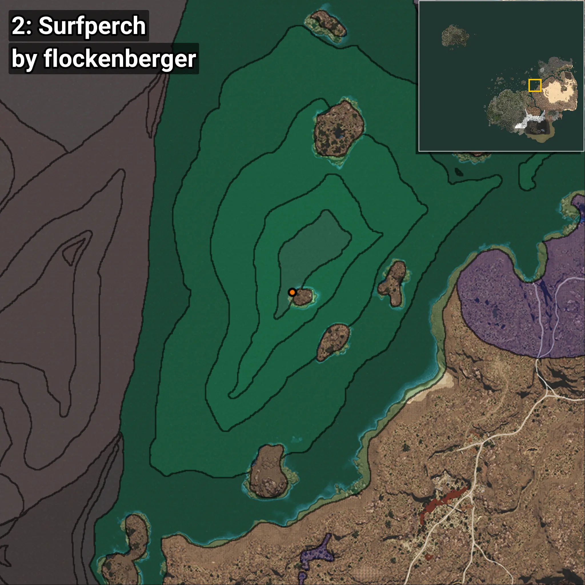
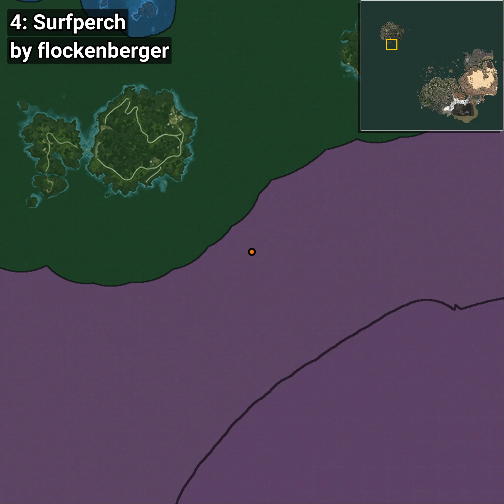
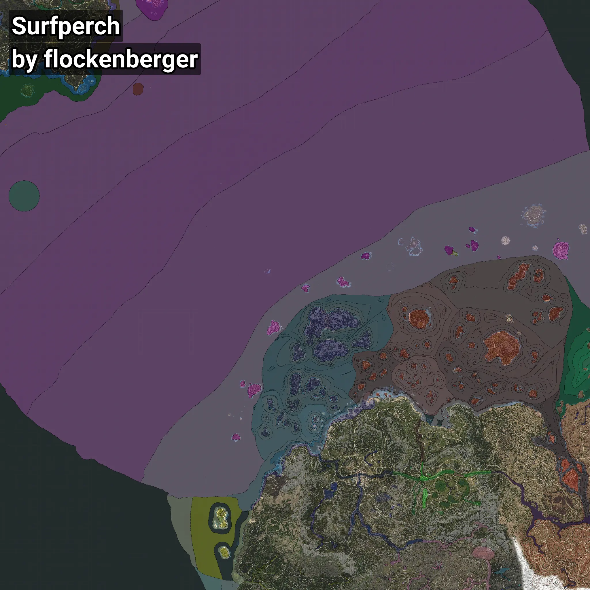

# Surfperch
```xml
<!--
    Waypoints for: Surfperch
    Created by: flockenberger
-->
<WorldmapBookMark>
    <BookMark BookMarkName="0: Surfperch" PosX="369803.0" PosY="-8217.0" PosZ="-23841.0" />
    <BookMark BookMarkName="1: Surfperch" PosX="369776.0" PosY="-8209.0" PosZ="-23880.0" />
    <BookMark BookMarkName="2: Surfperch" PosX="403423.0" PosY="-7852.0" PosZ="258828.0" />
    <BookMark BookMarkName="3: Surfperch" PosX="369752.0" PosY="-8203.0" PosZ="-23940.0" />
    <BookMark BookMarkName="4: Surfperch" PosX="-1287777.0" PosY="-7590.0" PosZ="971944.0" />
</WorldmapBookMark>
```

## ⚠️ Disclaimer
Waypoints are generated based on the __**character’s position**__ — __not__ where the fishing float landed.
Fish are determined by where your **float** lands!
In ocean spots especially, the direction you cast your rod can place your float in a **different fishing zone**, which may result in catching the wrong type of fish.
Please pay attention to the preview images showing where each location is in relation to the outlined zones.

- You can verify your float’s position using the guide [**HERE**](https://flockenberger.github.io/bdo-fish-position/)
- Or watch the video guide [**HERE**](https://youtu.be/t-VXcRoNojk)

## Previews
      