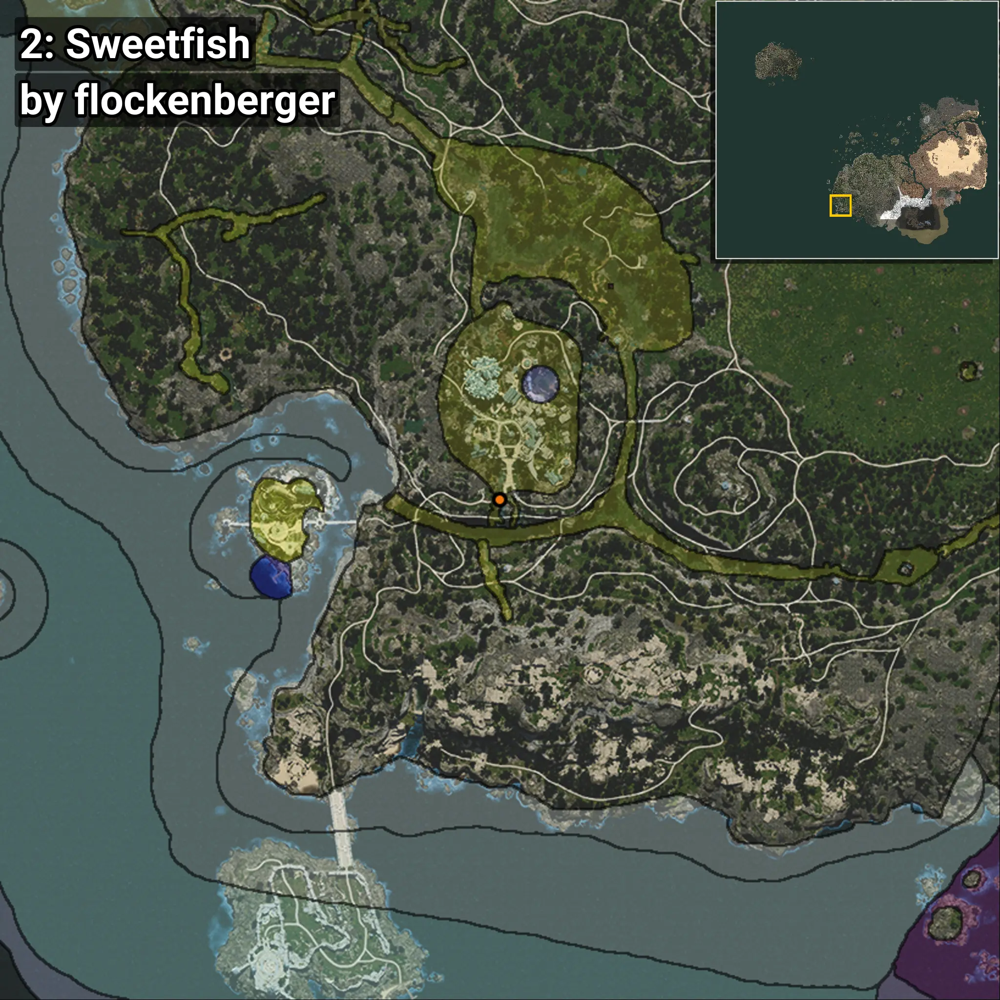
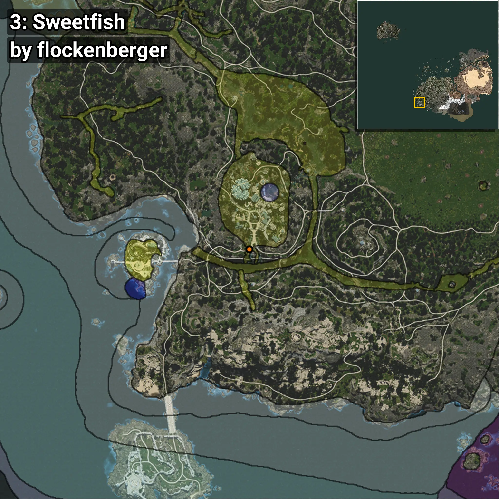
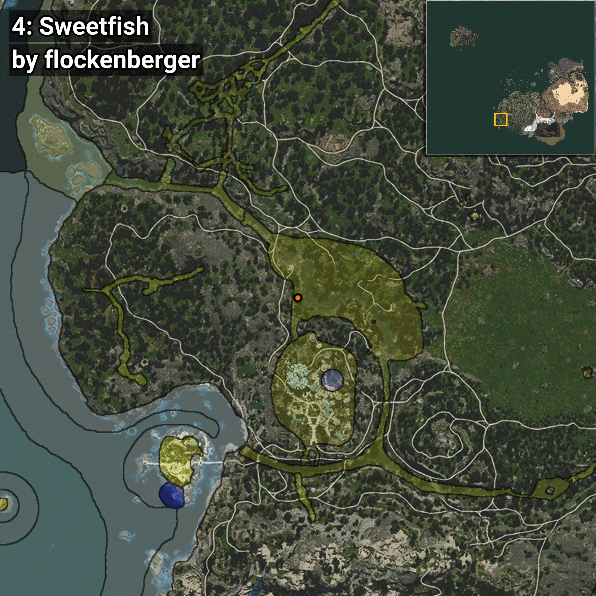

# Sweetfish
```xml
<!--
    Waypoints for: Sweetfish
    Created by: flockenberger
-->
<WorldmapBookMark>
    <BookMark BookMarkName="0: Sweetfish" PosX="-476276.4" PosY="-4742.2925" PosZ="-435016.9" />
    <BookMark BookMarkName="1: Sweetfish" PosX="-478574.0" PosY="-4935.0" PosZ="-424930.0" />
    <BookMark BookMarkName="2: Sweetfish" PosX="-507637.56" PosY="5605.631" PosZ="-475132.97" />
    <BookMark BookMarkName="3: Sweetfish" PosX="-507678.8" PosY="6574.045" PosZ="-474659.2" />
    <BookMark BookMarkName="4: Sweetfish" PosX="-511711.0" PosY="-4795.0" PosZ="-412479.0" />
</WorldmapBookMark>
```

## ⚠️ Disclaimer
Waypoints are generated based on the __**character’s position**__ — __not__ where the fishing float landed.
Fish are determined by where your **float** lands!
In ocean spots especially, the direction you cast your rod can place your float in a **different fishing zone**, which may result in catching the wrong type of fish.
Please pay attention to the preview images showing where each location is in relation to the outlined zones.

- You can verify your float’s position using the guide [**HERE**](https://flockenberger.github.io/bdo-fish-position/)
- Or watch the video guide [**HERE**](https://youtu.be/t-VXcRoNojk)

## Previews
      