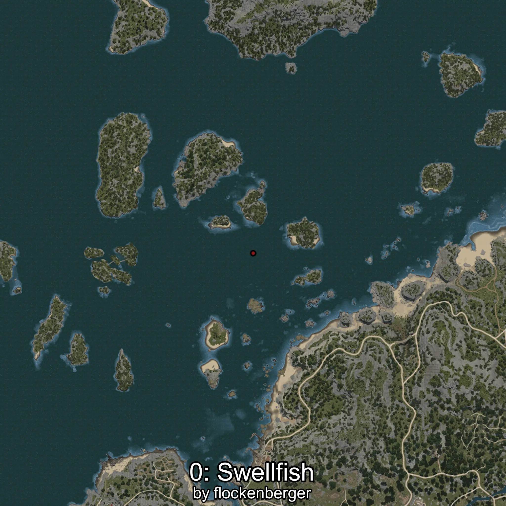
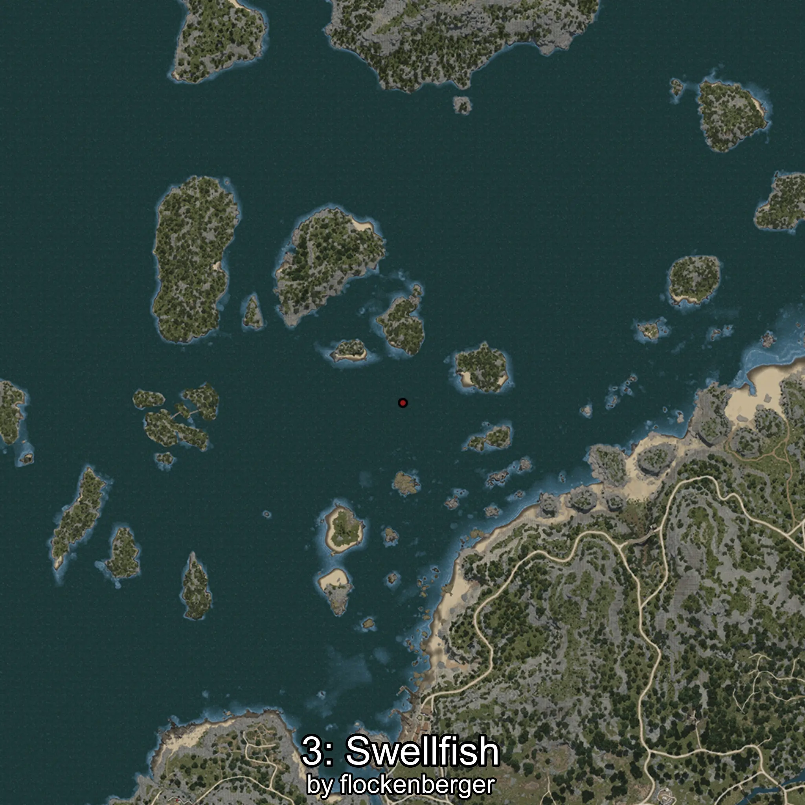
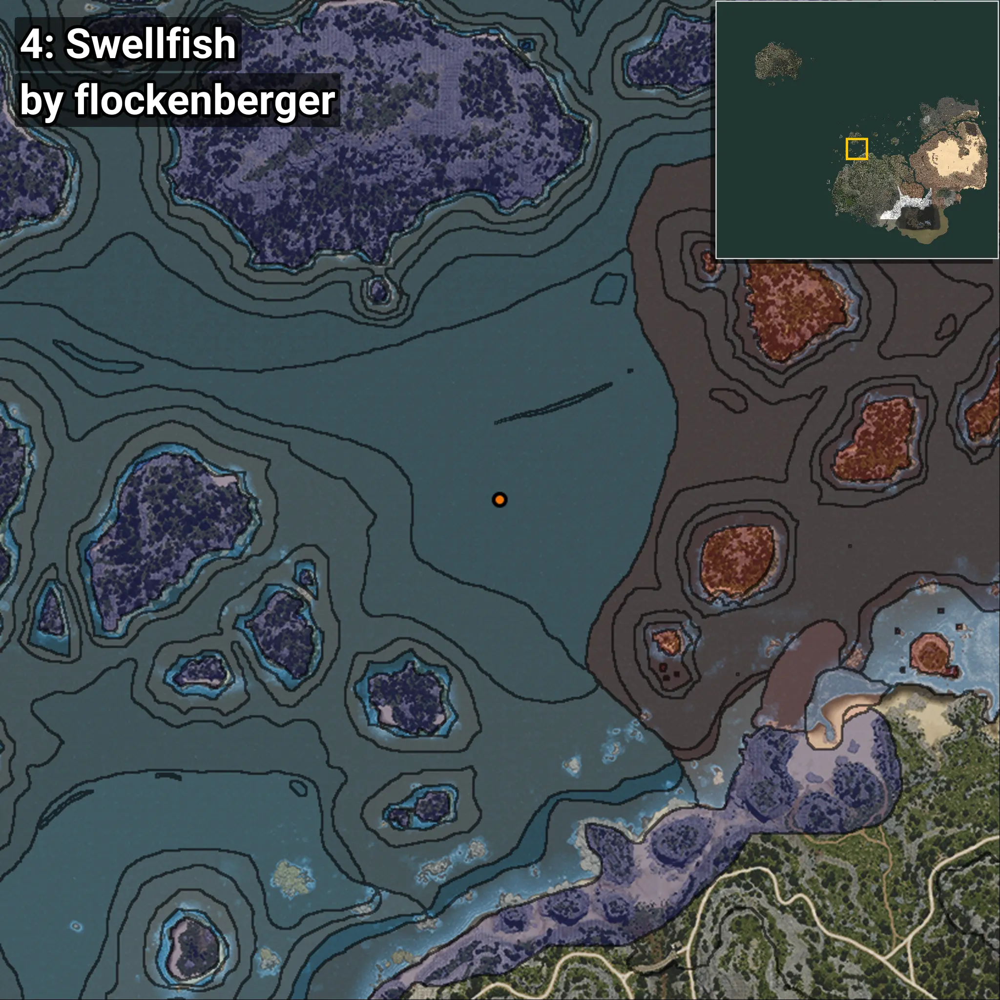

# Swellfish
```xml
<!--
    Waypoints for: Swellfish
    Created by: flockenberger
-->
<WorldmapBookMark>
    <BookMark BookMarkName="0: Swellfish" PosX="-289467.0" PosY="-7766.0" PosZ="233299.0" />
    <BookMark BookMarkName="1: Swellfish" PosX="-286096.0" PosY="-7893.0" PosZ="223866.0" />
    <BookMark BookMarkName="2: Swellfish" PosX="-292698.0" PosY="-8208.0" PosZ="180080.0" />
    <BookMark BookMarkName="3: Swellfish" PosX="-293756.1" PosY="-7890.073" PosZ="219453.86" />
    <BookMark BookMarkName="4: Swellfish" PosX="-307140.5" PosY="-7800.222" PosZ="221390.97" />
</WorldmapBookMark>
```

## ⚠️ Disclaimer
Waypoints are generated based on the __**character’s position**__ — __not__ where the fishing float landed.
Fish are determined by where your **float** lands!
In ocean spots especially, the direction you cast your rod can place your float in a **different fishing zone**, which may result in catching the wrong type of fish.
Please pay attention to the preview images showing where each location is in relation to the outlined zones.

- You can verify your float’s position using the guide [**HERE**](https://flockenberger.github.io/bdo-fish-position/)
- Or watch the video guide [**HERE**](https://youtu.be/t-VXcRoNojk)

## Previews
      