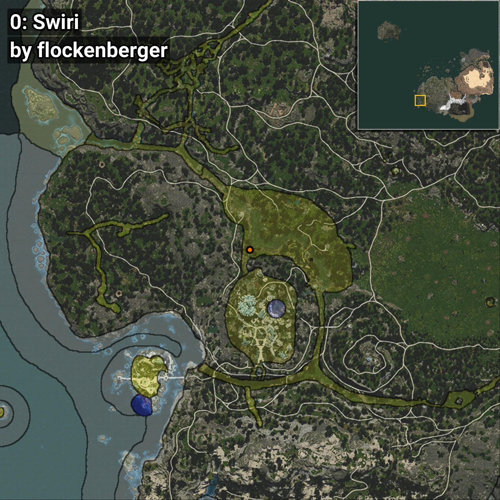
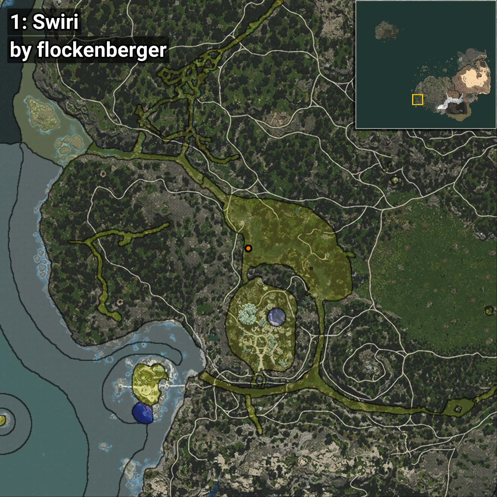
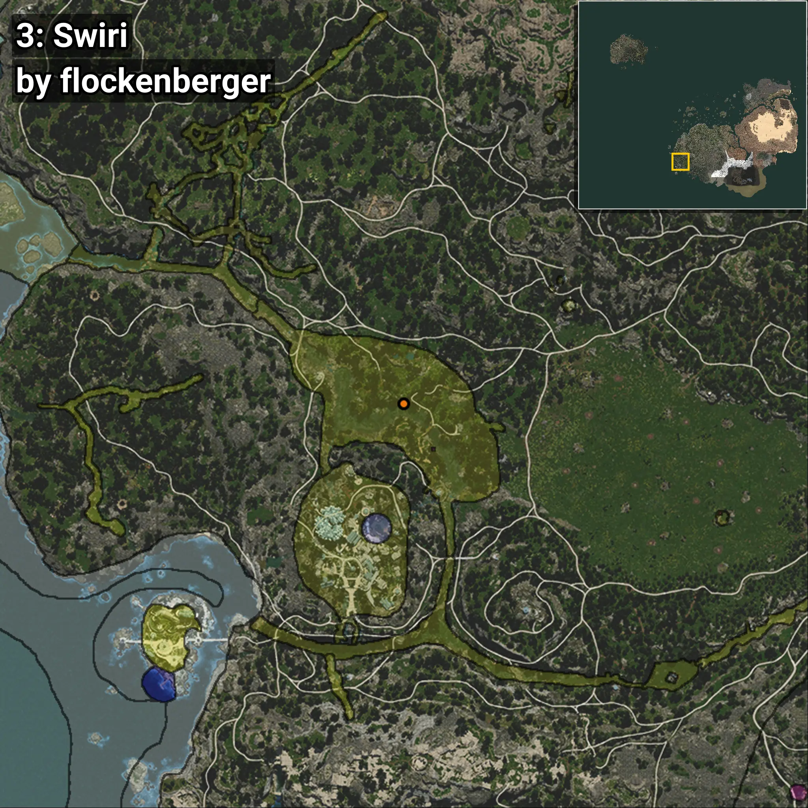
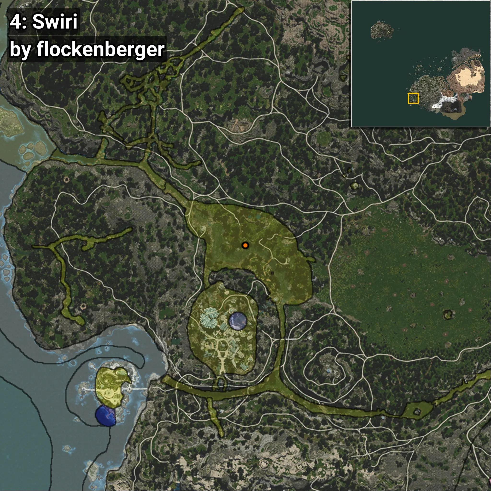

# Swiri
```xml
<!--
    Waypoints for: Swiri
    Created by: flockenberger
-->
<WorldmapBookMark>
    <BookMark BookMarkName="0: Swiri" PosX="-510628.66" PosY="-4565.7993" PosZ="-417589.6" />
    <BookMark BookMarkName="1: Swiri" PosX="-511650.0" PosY="-4802.0" PosZ="-412312.0" />
    <BookMark BookMarkName="2: Swiri" PosX="-488176.0" PosY="-4801.0" PosZ="-409685.0" />
    <BookMark BookMarkName="3: Swiri" PosX="-489161.0" PosY="-4752.0" PosZ="-408419.0" />
    <BookMark BookMarkName="4: Swiri" PosX="-493883.0" PosY="-4861.0" PosZ="-408435.0" />
</WorldmapBookMark>
```

## ⚠️ Disclaimer
Waypoints are generated based on the __**character’s position**__ — __not__ where the fishing float landed.
Fish are determined by where your **float** lands!
In ocean spots especially, the direction you cast your rod can place your float in a **different fishing zone**, which may result in catching the wrong type of fish.
Please pay attention to the preview images showing where each location is in relation to the outlined zones.

- You can verify your float’s position using the guide [**HERE**](https://flockenberger.github.io/bdo-fish-position/)
- Or watch the video guide [**HERE**](https://youtu.be/t-VXcRoNojk)

## Previews
      