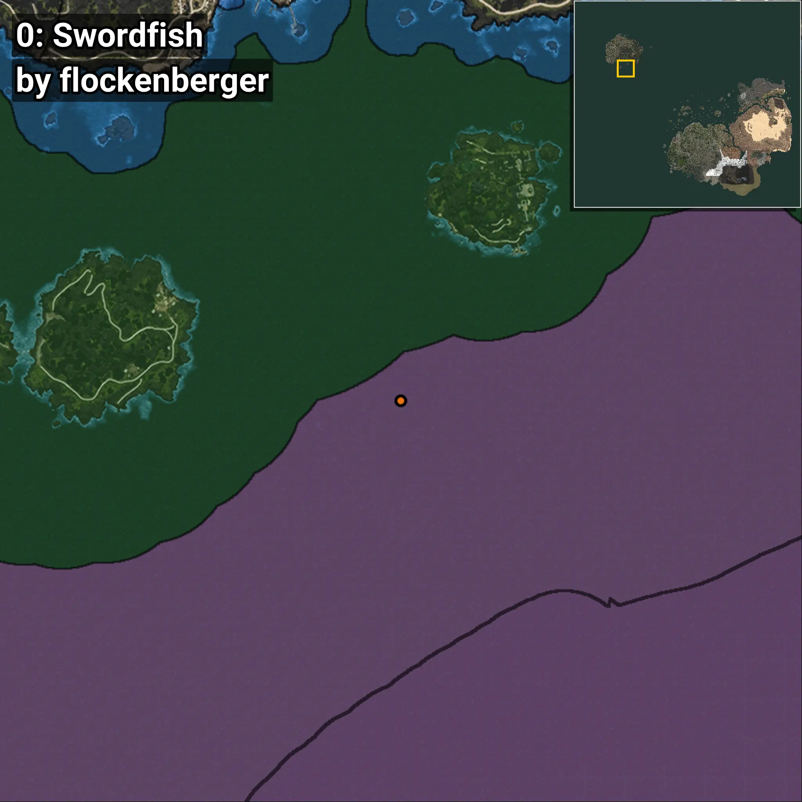
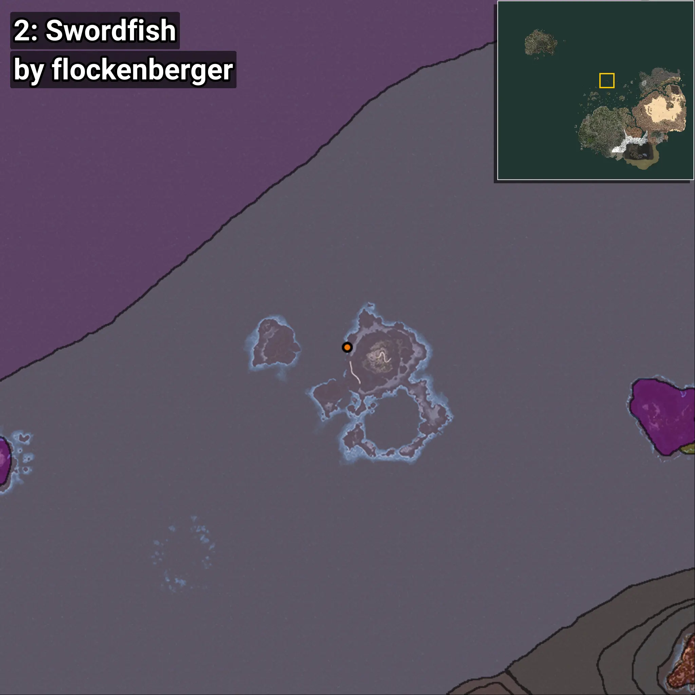
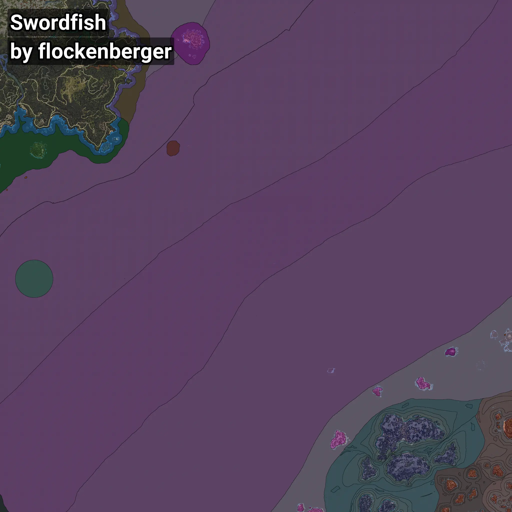

# Swordfish
```xml
<!--
    Waypoints for: Swordfish
    Created by: flockenberger
-->
<WorldmapBookMark>
    <BookMark BookMarkName="0: Swordfish" PosX="-1252401.0" PosY="-7912.0" PosZ="1007036.0" />
    <BookMark BookMarkName="1: Swordfish" PosX="-1254948.0" PosY="-8078.0" PosZ="1005467.0" />
    <BookMark BookMarkName="2: Swordfish" PosX="-105675.0" PosY="-8197.0" PosZ="628887.0" />
    <BookMark BookMarkName="3: Swordfish" PosX="-105679.0" PosY="-8198.0" PosZ="628878.0" />
    <BookMark BookMarkName="4: Swordfish" PosX="-1299001.8" PosY="-7659.725" PosZ="976580.2" />
</WorldmapBookMark>
```

## ⚠️ Disclaimer
Waypoints are generated based on the __**character’s position**__ — __not__ where the fishing float landed.
Fish are determined by where your **float** lands!
In ocean spots especially, the direction you cast your rod can place your float in a **different fishing zone**, which may result in catching the wrong type of fish.
Please pay attention to the preview images showing where each location is in relation to the outlined zones.

- You can verify your float’s position using the guide [**HERE**](https://flockenberger.github.io/bdo-fish-position/)
- Or watch the video guide [**HERE**](https://youtu.be/t-VXcRoNojk)

## Previews
      