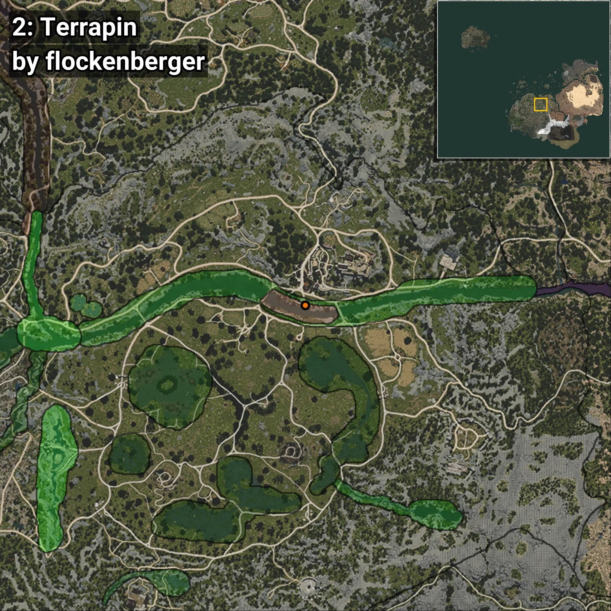

# Terrapin
```xml
<!--
    Waypoints for: Terrapin
    Created by: flockenberger
-->
<WorldmapBookMark>
    <BookMark BookMarkName="0: Terrapin" PosX="38083.816" PosY="-4018.4517" PosZ="-50714.473" />
    <BookMark BookMarkName="1: Terrapin" PosX="38119.766" PosY="-4025.3662" PosZ="-50758.656" />
    <BookMark BookMarkName="2: Terrapin" PosX="38743.0" PosY="-4004.0" PosZ="-50782.0" />
    <BookMark BookMarkName="3: Terrapin" PosX="38712.58" PosY="-4002.7458" PosZ="-50773.082" />
    <BookMark BookMarkName="4: Terrapin" PosX="39318.0" PosY="-4034.0" PosZ="-51127.0" />
</WorldmapBookMark>
```

## ⚠️ Disclaimer
Waypoints are generated based on the __**character’s position**__ — __not__ where the fishing float landed.
Fish are determined by where your **float** lands!
In ocean spots especially, the direction you cast your rod can place your float in a **different fishing zone**, which may result in catching the wrong type of fish.
Please pay attention to the preview images showing where each location is in relation to the outlined zones.

- You can verify your float’s position using the guide [**HERE**](https://flockenberger.github.io/bdo-fish-position/)
- Or watch the video guide [**HERE**](https://youtu.be/t-VXcRoNojk)

## Previews
      