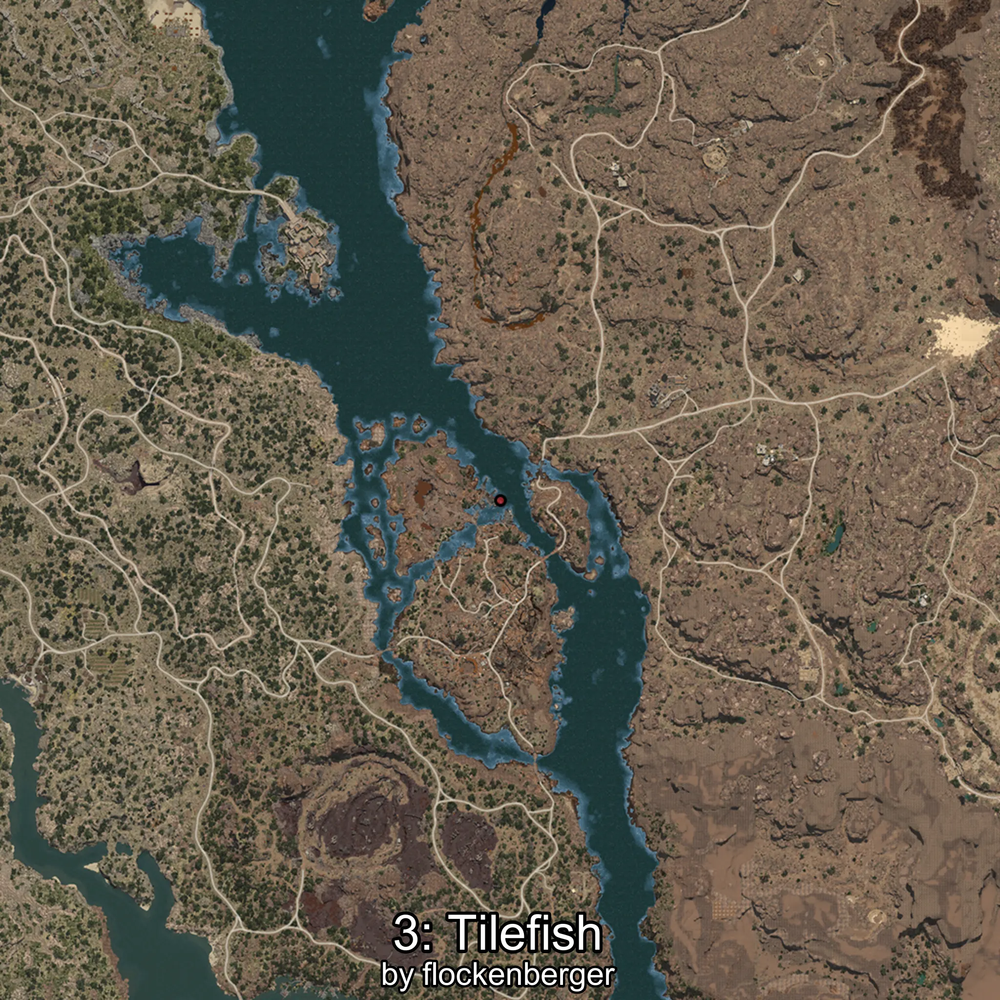
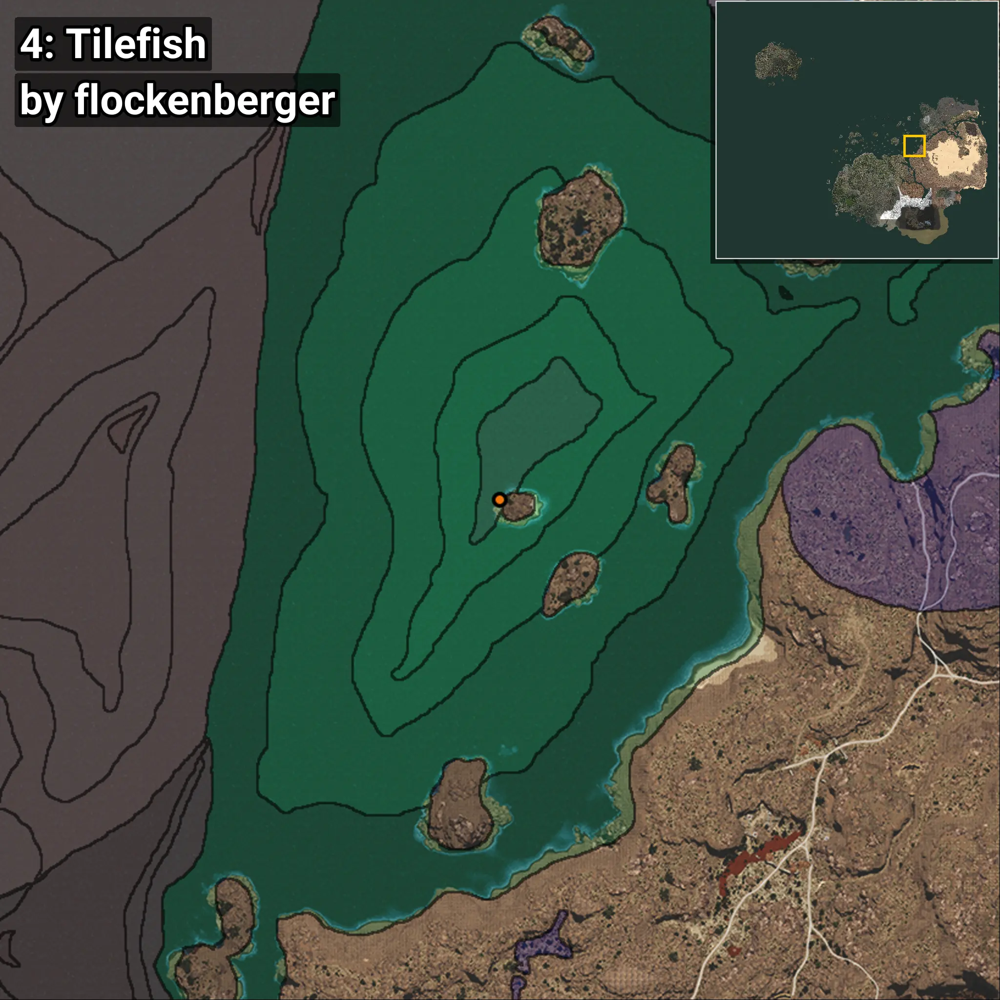

# Tilefish
```xml
<!--
    Waypoints for: Tilefish
    Created by: flockenberger
-->
<WorldmapBookMark>
    <BookMark BookMarkName="0: Tilefish" PosX="369775.0" PosY="-8201.0" PosZ="-24159.0" />
    <BookMark BookMarkName="1: Tilefish" PosX="369827.03" PosY="-8212.178" PosZ="-24085.396" />
    <BookMark BookMarkName="2: Tilefish" PosX="403207.0" PosY="-7924.0" PosZ="258788.0" />
    <BookMark BookMarkName="3: Tilefish" PosX="403200.0" PosY="-7922.0" PosZ="258783.0" />
    <BookMark BookMarkName="4: Tilefish" PosX="403116.0" PosY="-7913.0" PosZ="258651.0" />
</WorldmapBookMark>
```

## ⚠️ Disclaimer
Waypoints are generated based on the __**character’s position**__ — __not__ where the fishing float landed.
Fish are determined by where your **float** lands!
In ocean spots especially, the direction you cast your rod can place your float in a **different fishing zone**, which may result in catching the wrong type of fish.
Please pay attention to the preview images showing where each location is in relation to the outlined zones.

- You can verify your float’s position using the guide [**HERE**](https://flockenberger.github.io/bdo-fish-position/)
- Or watch the video guide [**HERE**](https://youtu.be/t-VXcRoNojk)

## Previews
      