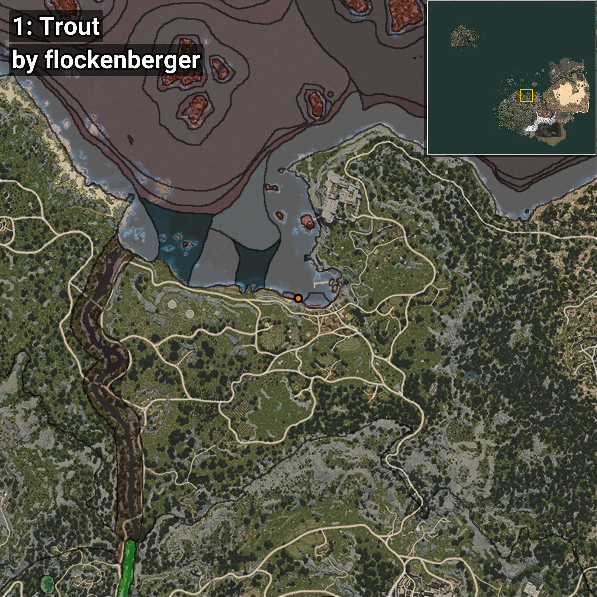
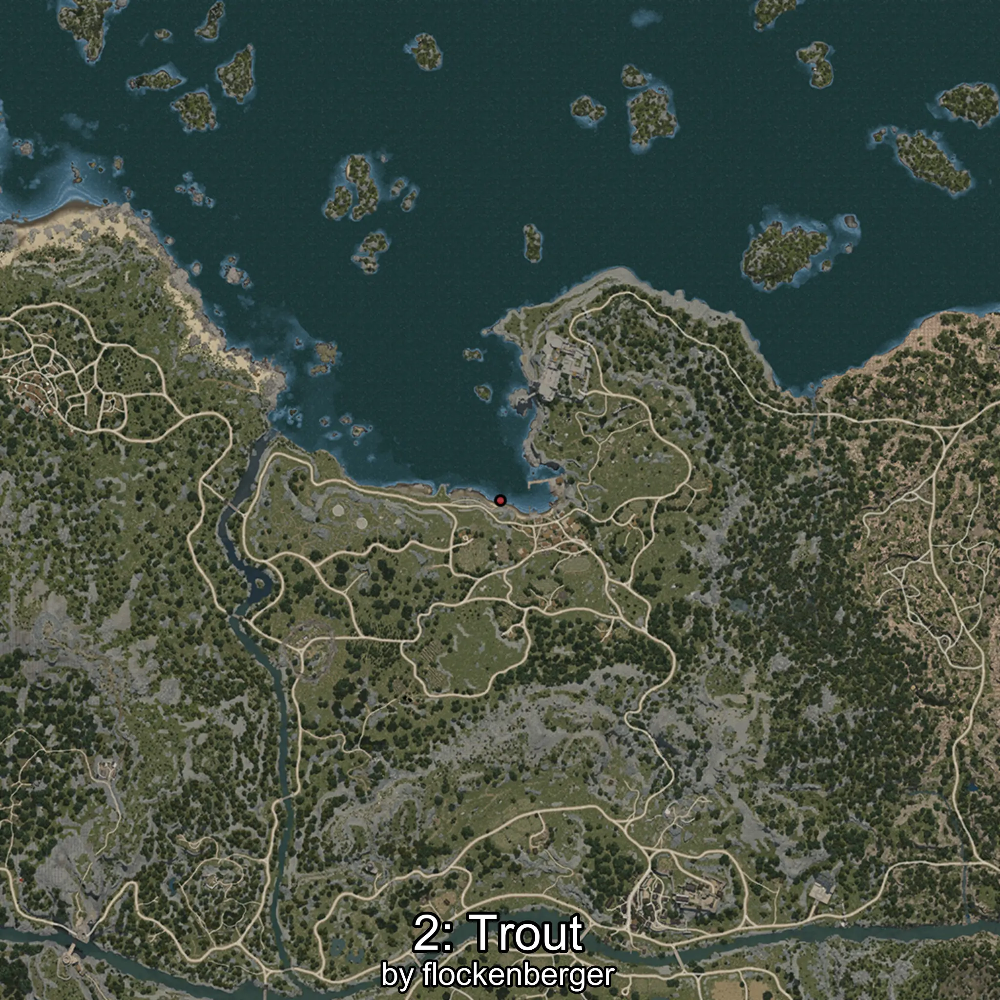
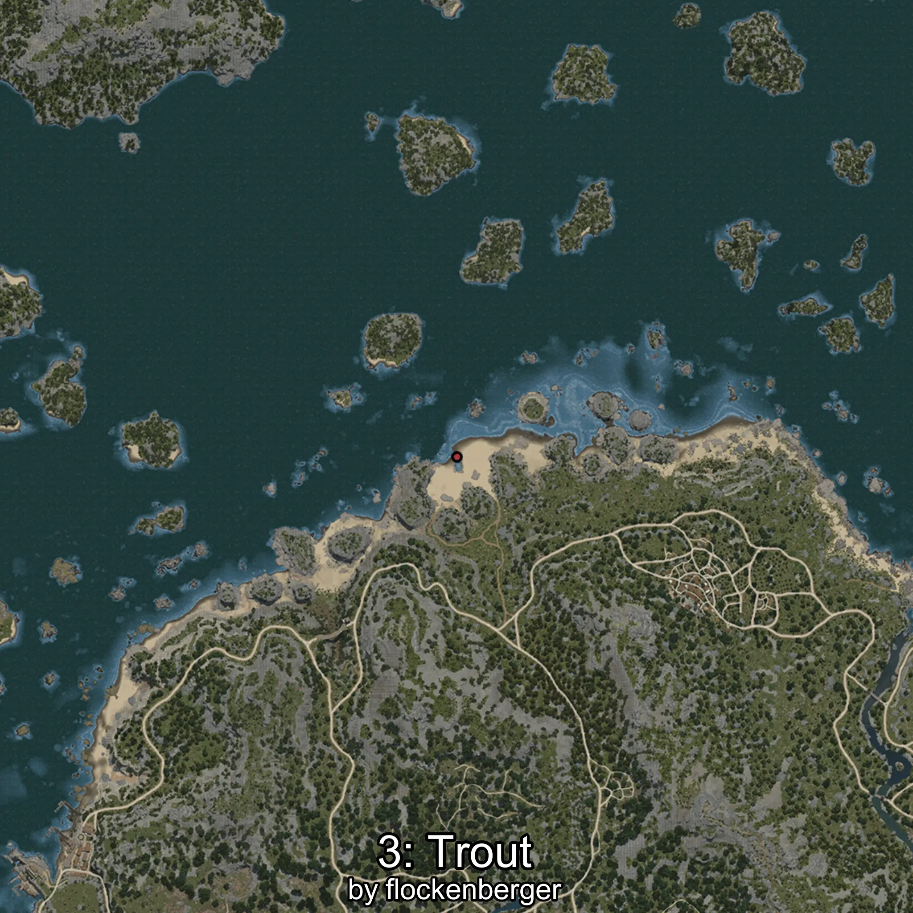
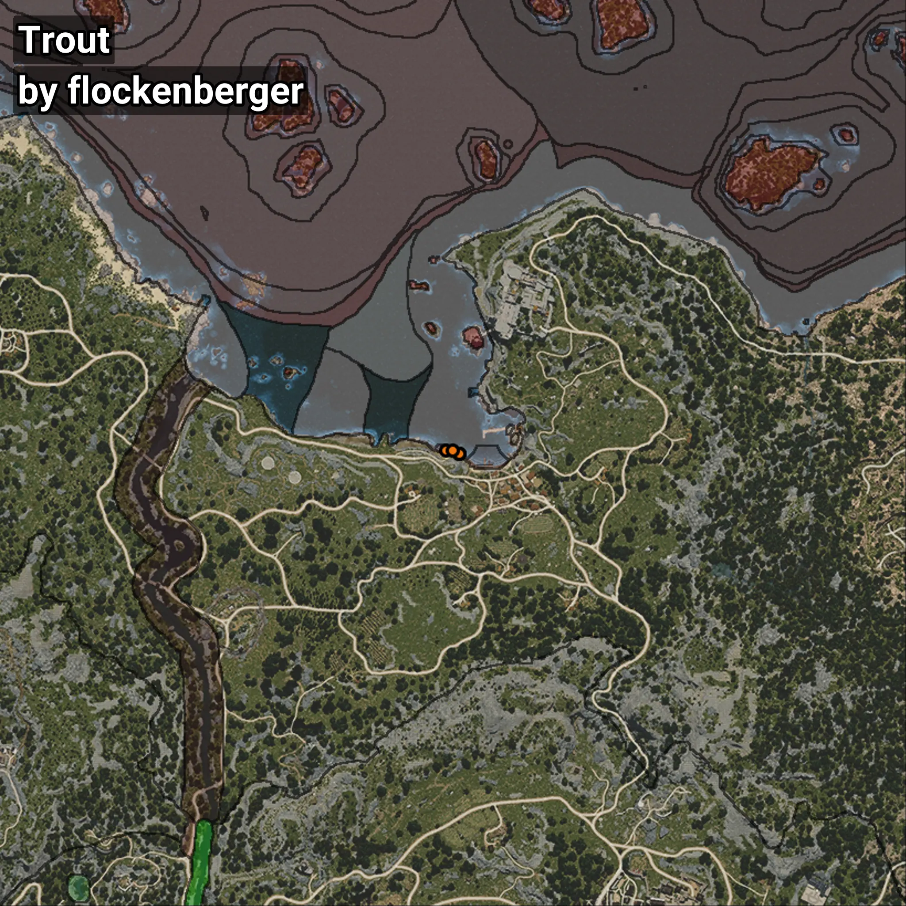

# Trout
```xml
<!--
    Waypoints for: Trout
    Created by: flockenberger
-->
<WorldmapBookMark>
    <BookMark BookMarkName="0: Trout" PosX="-195.0" PosY="-8178.0" PosZ="87209.0" />
    <BookMark BookMarkName="1: Trout" PosX="-262.38174" PosY="-8154.9346" PosZ="87125.46" />
    <BookMark BookMarkName="2: Trout" PosX="-3782.0" PosY="-8193.0" PosZ="88052.0" />
    <BookMark BookMarkName="3: Trout" PosX="-272.80365" PosY="-8153.312" PosZ="87119.91" />
    <BookMark BookMarkName="4: Trout" PosX="-1908.2161" PosY="-8207.413" PosZ="87978.69" />
</WorldmapBookMark>
```

## ⚠️ Disclaimer
Waypoints are generated based on the __**character’s position**__ — __not__ where the fishing float landed.
Fish are determined by where your **float** lands!
In ocean spots especially, the direction you cast your rod can place your float in a **different fishing zone**, which may result in catching the wrong type of fish.
Please pay attention to the preview images showing where each location is in relation to the outlined zones.

- You can verify your float’s position using the guide [**HERE**](https://flockenberger.github.io/bdo-fish-position/)
- Or watch the video guide [**HERE**](https://youtu.be/t-VXcRoNojk)

## Previews
      