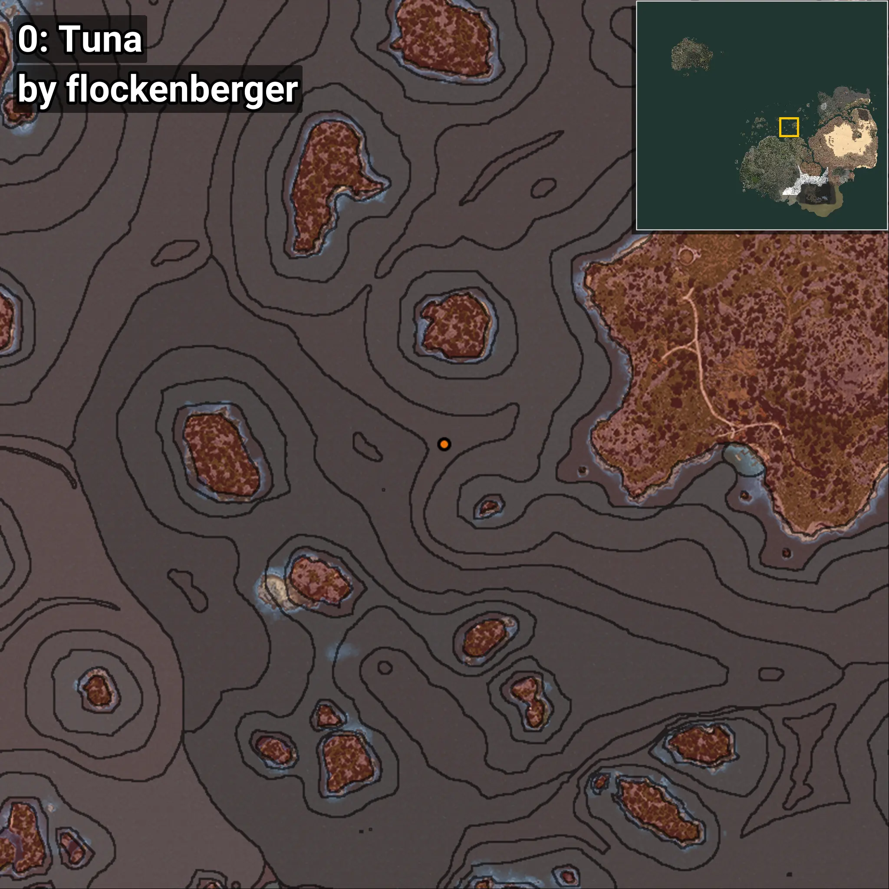
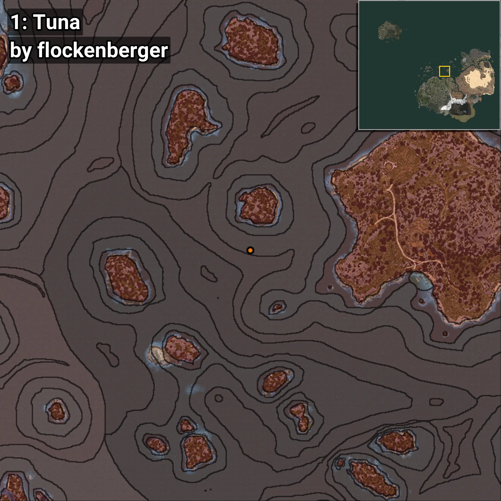
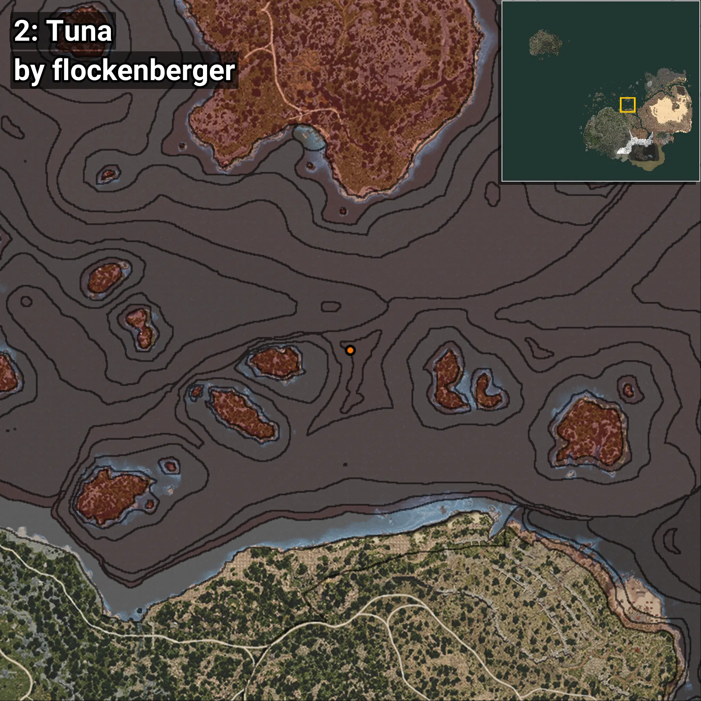
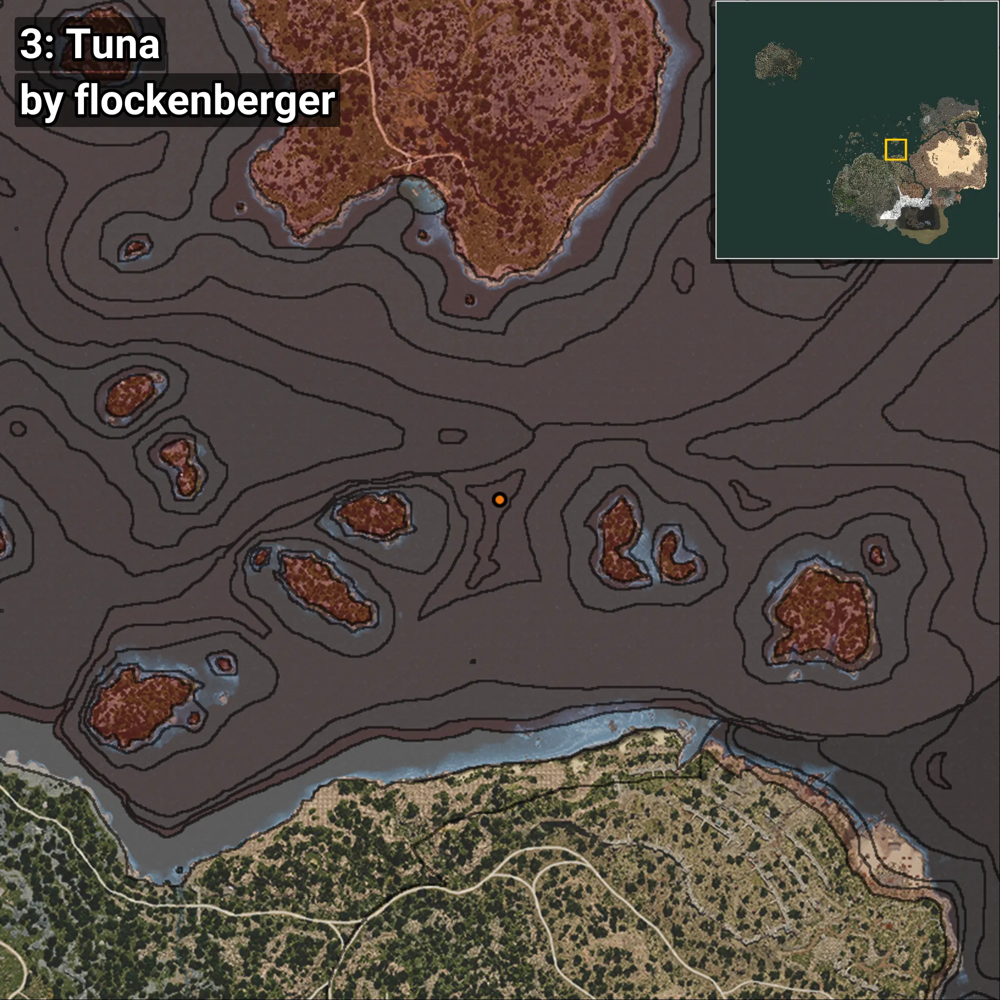
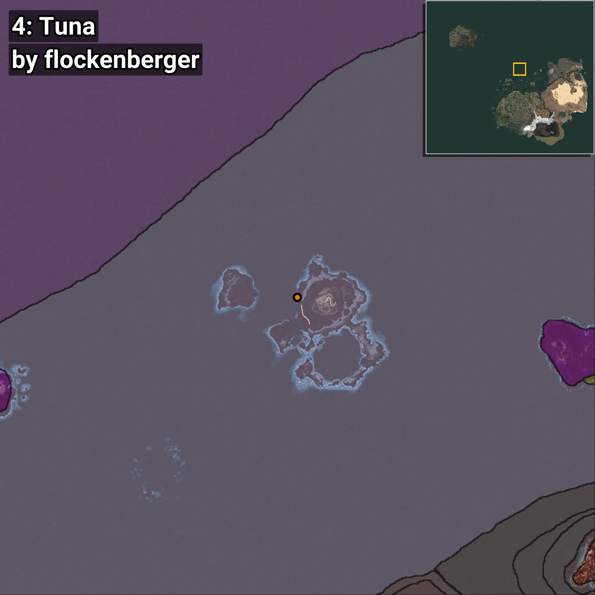
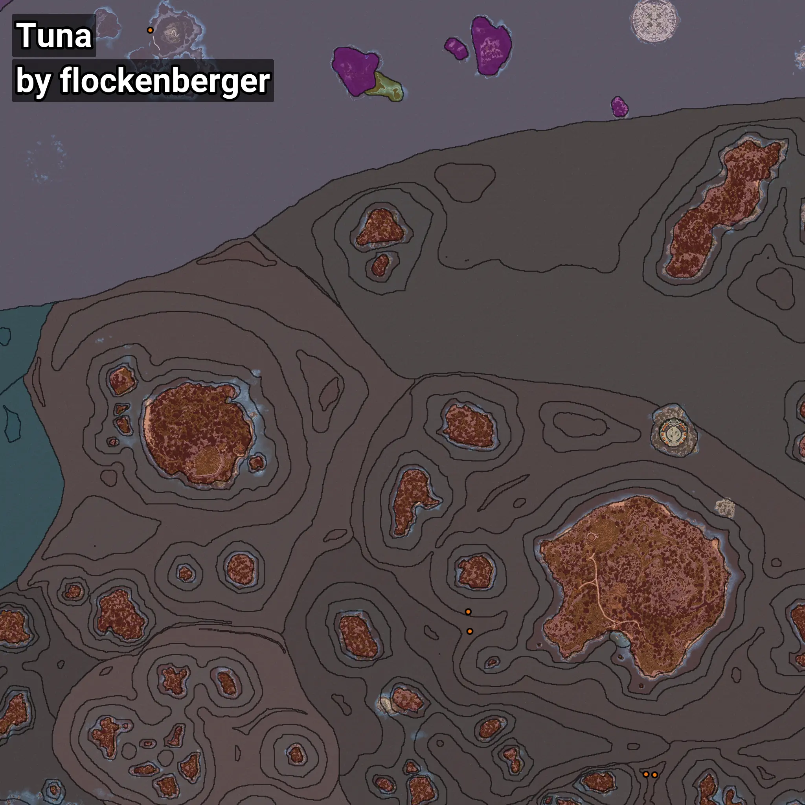

# Tuna
```xml
<!--
    Waypoints for: Tuna
    Created by: flockenberger
-->
<WorldmapBookMark>
    <BookMark BookMarkName="0: Tuna" PosX="70981.0" PosY="-7499.0" PosZ="294074.0" />
    <BookMark BookMarkName="1: Tuna" PosX="70098.0" PosY="-7646.0" PosZ="304982.0" />
    <BookMark BookMarkName="2: Tuna" PosX="168599.08" PosY="-7654.796" PosZ="214810.42" />
    <BookMark BookMarkName="3: Tuna" PosX="173322.0" PosY="-7911.0" PosZ="214564.0" />
    <BookMark BookMarkName="4: Tuna" PosX="-106170.0" PosY="-7952.0" PosZ="627252.0" />
</WorldmapBookMark>
```

## ⚠️ Disclaimer
Waypoints are generated based on the __**character’s position**__ — __not__ where the fishing float landed.
Fish are determined by where your **float** lands!
In ocean spots especially, the direction you cast your rod can place your float in a **different fishing zone**, which may result in catching the wrong type of fish.
Please pay attention to the preview images showing where each location is in relation to the outlined zones.

- You can verify your float’s position using the guide [**HERE**](https://flockenberger.github.io/bdo-fish-position/)
- Or watch the video guide [**HERE**](https://youtu.be/t-VXcRoNojk)

## Previews
      