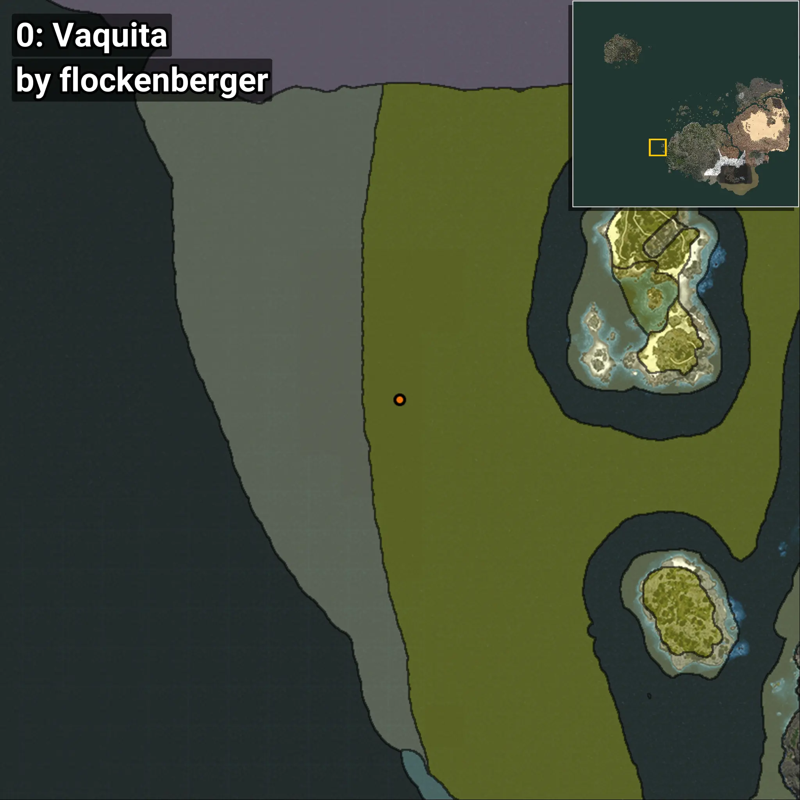
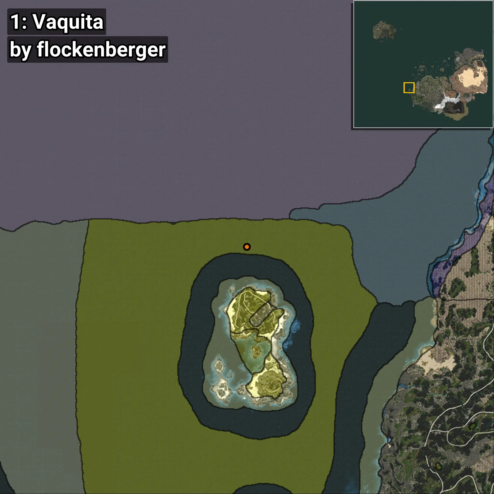
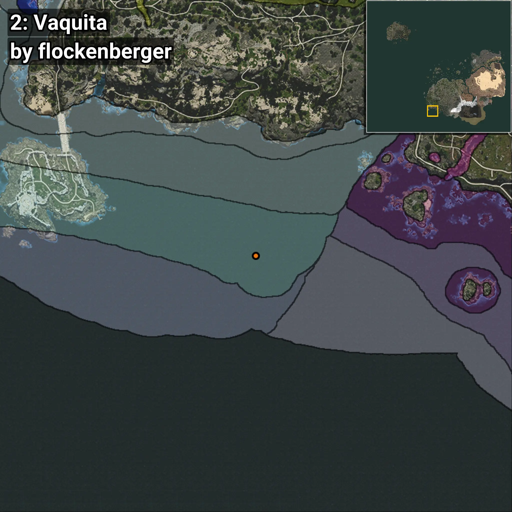
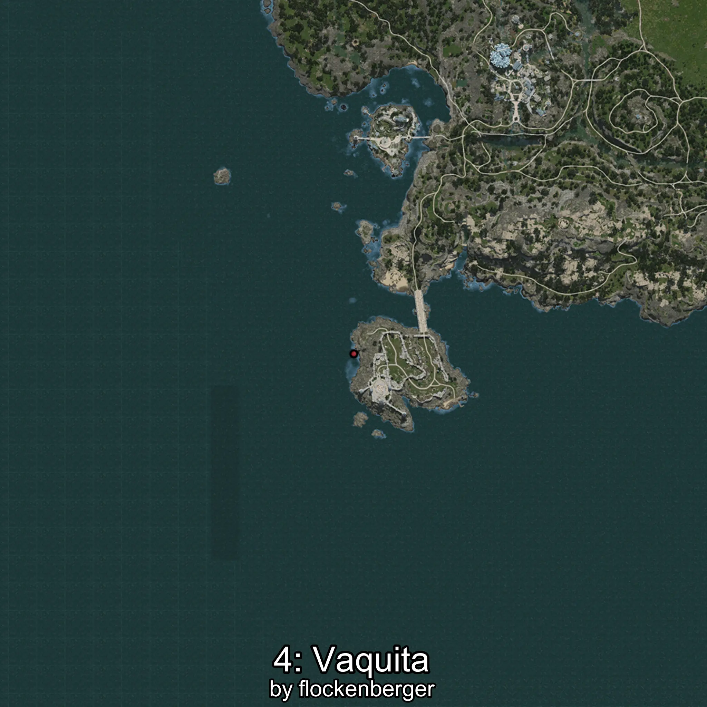

# Vaquita
```xml
<!--
    Waypoints for: Vaquita
    Created by: flockenberger
-->
<WorldmapBookMark>
    <BookMark BookMarkName="0: Vaquita" PosX="-735513.0" PosY="-7714.0" PosZ="-213033.0" />
    <BookMark BookMarkName="1: Vaquita" PosX="-661779.0" PosY="-7197.0" PosZ="-129410.0" />
    <BookMark BookMarkName="2: Vaquita" PosX="-454061.0" PosY="-7590.0" PosZ="-615855.0" />
    <BookMark BookMarkName="3: Vaquita" PosX="-521045.0" PosY="-7590.0" PosZ="-594949.0" />
    <BookMark BookMarkName="4: Vaquita" PosX="-555685.8" PosY="-7967.1934" PosZ="-593495.44" />
</WorldmapBookMark>
```

## ⚠️ Disclaimer
Waypoints are generated based on the __**character’s position**__ — __not__ where the fishing float landed.
Fish are determined by where your **float** lands!
In ocean spots especially, the direction you cast your rod can place your float in a **different fishing zone**, which may result in catching the wrong type of fish.
Please pay attention to the preview images showing where each location is in relation to the outlined zones.

- You can verify your float’s position using the guide [**HERE**](https://flockenberger.github.io/bdo-fish-position/)
- Or watch the video guide [**HERE**](https://youtu.be/t-VXcRoNojk)

## Previews
      