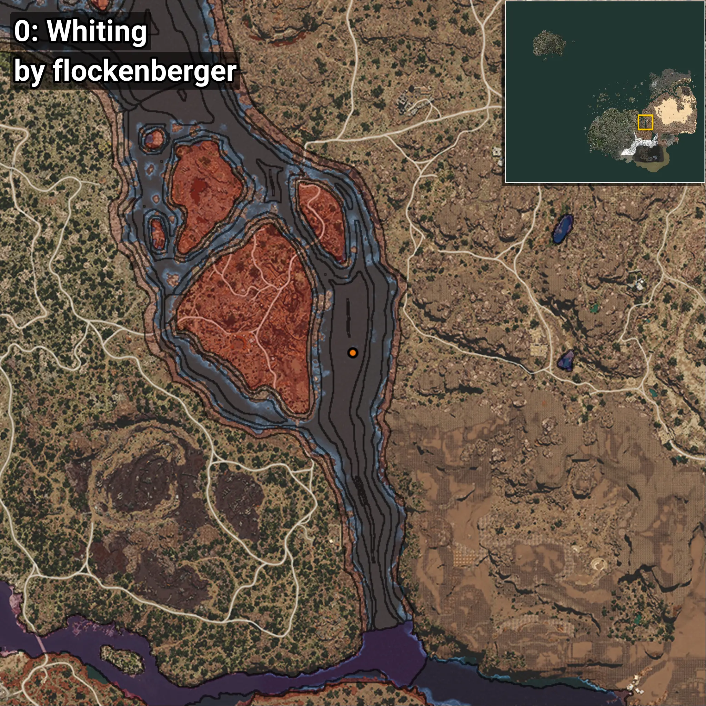
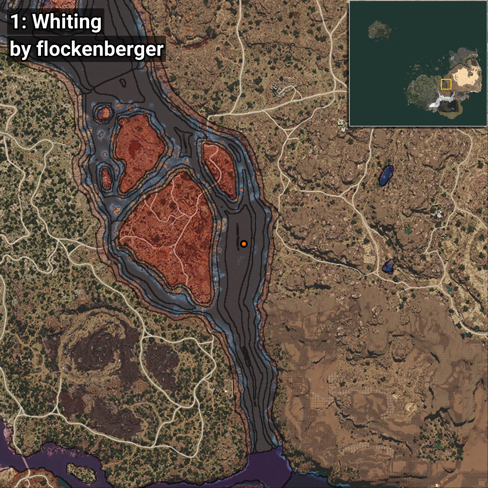

# Whiting
```xml
<!--
    Waypoints for: Whiting
    Created by: flockenberger
-->
<WorldmapBookMark>
    <BookMark BookMarkName="0: Whiting" PosX="400073.0" PosY="-7755.0" PosZ="-78556.0" />
    <BookMark BookMarkName="1: Whiting" PosX="401602.7" PosY="-7889.869" PosZ="-69733.06" />
    <BookMark BookMarkName="2: Whiting" PosX="175019.0" PosY="-7802.0" PosZ="209483.0" />
    <BookMark BookMarkName="3: Whiting" PosX="173694.0" PosY="-7581.0" PosZ="208009.0" />
    <BookMark BookMarkName="4: Whiting" PosX="297406.84" PosY="-7908.4688" PosZ="177470.95" />
</WorldmapBookMark>
```

## ⚠️ Disclaimer
Waypoints are generated based on the __**character’s position**__ — __not__ where the fishing float landed.
Fish are determined by where your **float** lands!
In ocean spots especially, the direction you cast your rod can place your float in a **different fishing zone**, which may result in catching the wrong type of fish.
Please pay attention to the preview images showing where each location is in relation to the outlined zones.

- You can verify your float’s position using the guide [**HERE**](https://flockenberger.github.io/bdo-fish-position/)
- Or watch the video guide [**HERE**](https://youtu.be/t-VXcRoNojk)

## Previews
      